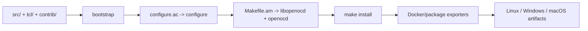

# Build and release architecture

The repository has two related build products:

1. the native OpenOCD executable and its installed runtime data;
2. documentation and platform packages produced by CI/Docker wrappers.

The source tree remains Autotools-based. Docker and GitHub Actions orchestrate
the same configure/make/install process; they are packaging boundaries, not a
second implementation.

## Native build graph

`src/Makefile.am` links the executable against `libopenocd.la`, which in turn
collects the internal libraries:

| Internal library | Responsibility |
|---|---|
| `libhelper` | logging, command registry, options, configuration, file and utility helpers |
| `libjtag` | adapter abstraction, JTAG/SWD-related code, interfaces, and adapter driver library |
| `libtransport` | transport selection and transport implementations |
| `libtarget` | target types, CPU/debug architecture, registers, memory, reset, SMP, and RTOS hooks |
| `libflash` | NOR/NAND flash cores and drivers |
| `libprogrammer` | programmer-specific native integrations such as Microchip extensions |
| `libpld` | FPGA/CPLD drivers and IPDBG integration |
| `libsvf` / `libxsvf` | SVF and XSVF playback |
| `libserver` | GDB, Telnet, Tcl, signal, socket, and event-loop services |
| `librtos` / `librtt` | RTOS awareness and RTT support |
| `libavr` | AVR catalog, USBASP, and embedded AVRDUDE backend sources |

Optional libraries and adapter drivers are selected by `configure.ac`, then
registered through compile-time driver tables such as `src/jtag/interfaces.c`
and `src/target/target.c`.

## Generated startup Tcl

The build collects subsystem startup files through `STARTUP_TCL_SRCS` and
converts them to `src/startup_tcl.inc`. `src/openocd.c` embeds this array and
passes it to `command_init()`. This gives every OpenOCD binary a minimal,
version-matched bootstrap while keeping user board/target scripts external and
overrideable.

## Packaging path

| Stage | Implementation | Output |
|---|---|---|
| Source preparation | `docker/scripts/prepare-openocd-source.sh` | Submodules, line endings, executable bits, and fallback dependency commits are normalized. |
| Linux build | `docker/Dockerfile.linux-package` | `/out/openocd-linux-<arch>.tar.gz` and package directory. |
| Windows build | `docker/Dockerfile.windows-cross` | `/out/openocd-windows-x86_64.zip` and USB-driver helper payload. |
| macOS build | `docker/scripts/build-macos-package.sh` | `artifacts/macos/*.tar.gz`. |
| Runtime image | `docker/Dockerfile` | `/opt/openocd` image with `tini`, GDB, USB libraries, and script path. |
| Documentation | `docker/Dockerfile.docs`, `.github/workflows/docs.yml` | MkDocs HTML artifact under `docs/_build/html`. |

## CI boundaries

- `docs.yml` validates the generated support matrix and runs
  `python3 -m mkdocs build --strict`.
- `docker.yml` builds the runtime image for amd64 and arm64.
- `packages.yml` exports Linux/Windows packages and builds macOS packages on
  native runners.
- `microchip-programmers.yml` runs command-generation tests for the bridge
  integration.
- `snapshot.yml` covers the source snapshot/cross-build path.

Changes that affect `src/`, `tcl/`, `support/`, `docker/`, or the build files
should update the relevant workflow path filters and the corresponding
documentation page.
