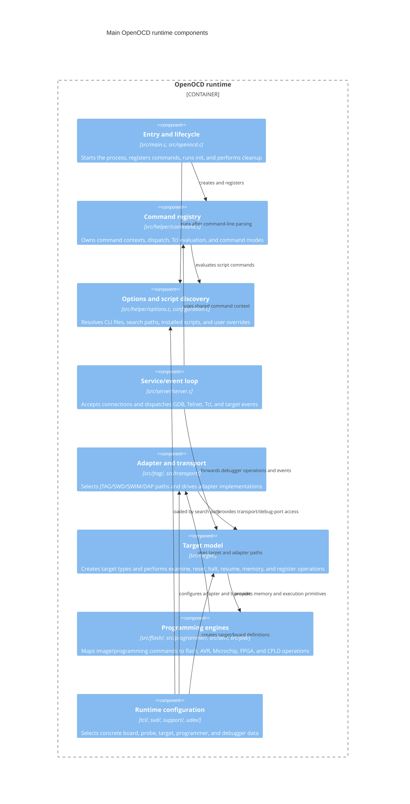
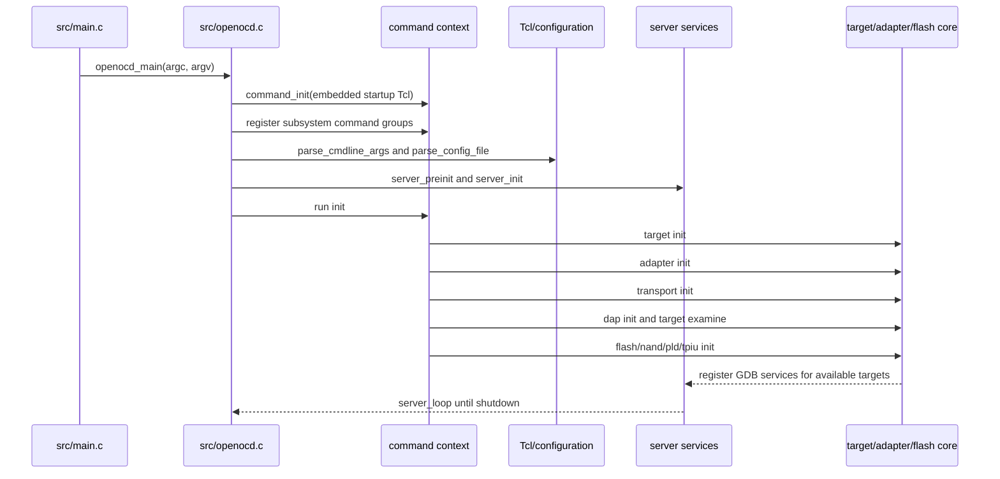
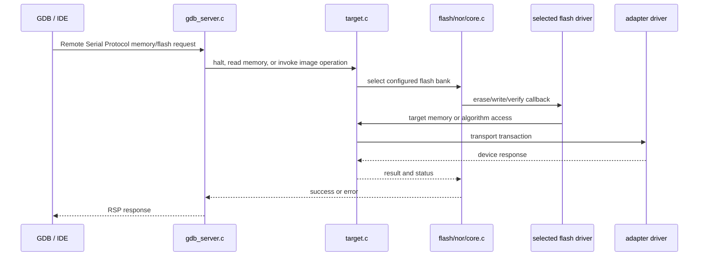

# C4 components: source-level responsibilities and call flow

This view goes one level below the logical containers. It is intentionally
organized around stable source responsibilities rather than individual vendor
drivers.

## Startup and initialization flow

The ordering is significant. Configuration must select the adapter and target
before `init`; target examination must happen before GDB services are attached;
and flash/PLD initialization is performed after the target/debug path is ready.
The implementation is visible in `handle_init_command()` and
`openocd_thread()` in `src/openocd.c`.

## Operation flow: GDB flash programming

## Extension points

| Extension kind | Interface/registry | Typical files | Runtime selection |
|---|---|---|---|
| Adapter | `struct adapter_driver`, `adapter_drivers[]` | `src/jtag/drivers/*.c`, `src/jtag/interfaces.c` | `tcl/interface/*.cfg` and configure flags |
| Transport | `struct transport`, `transport_register()` | `src/transport/`, `src/target/adi_v5_*` | `transport select`, adapter capabilities, and Tcl |
| Target | `struct target_type`, `target_types[]` | `src/target/*.c` | `tcl/target/*.cfg` |
| NOR flash | `struct flash_driver` | `src/flash/nor/*.c` | `flash bank` command in Tcl |
| NAND controller | controller registry | `src/flash/nand/` | NAND Tcl commands |
| Programmer | command registrants and Tcl bridge | `src/programmer/`, `src/avr/`, `tcl/programmer/` | programmer/board config |
| PLD/SVF/XSVF | PLD driver tables and command groups | `src/pld/`, `src/svf/`, `src/xsvf/` | `pld`, `svf`, or `xsvf` commands |
| RTOS/trace | target hooks and service registrants | `src/rtos/`, `src/rtt/`, `src/server/` | target detection and Tcl configuration |

New code should follow the existing registry pattern and keep board-specific
choices in Tcl or support metadata where possible.
