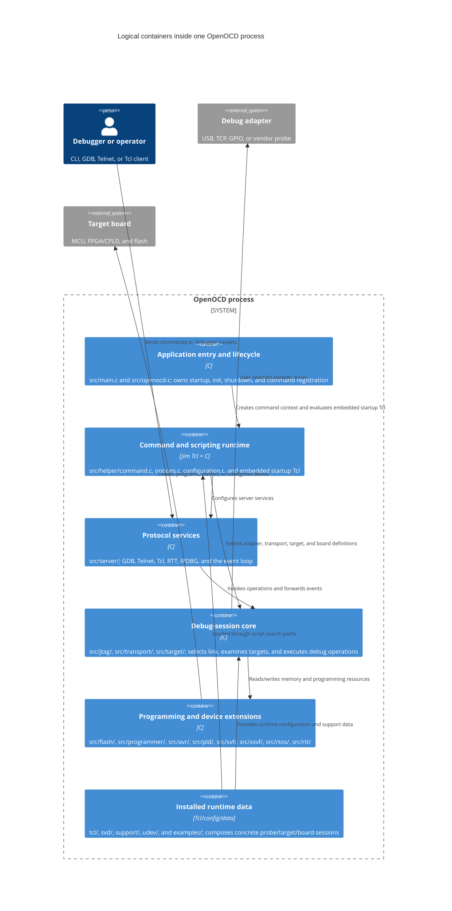

# C4 containers: the OpenOCD runtime

OpenOCD is linked as one executable and one internal library (`libopenocd`),
but it has clear logical containers. Keeping these boundaries explicit helps
contributors decide whether a change belongs in C, Tcl data, a build option, or
an external integration.



## Container responsibilities

### Application entry and lifecycle

`src/main.c` is the native executable entry point. It disables stdout/stderr
buffering and calls `openocd_main()` from `src/openocd.c`. The lifecycle is:

1. `setup_command_handler()` creates the command context, registers built-in
   subsystem commands, and evaluates the embedded `startup.tcl`.
2. `parse_cmdline_args()` processes `-f`, `-c`, `-s`, logging, and help/version
   options.
3. `server_preinit()` installs signal handling, then configuration scripts are
   evaluated.
4. `server_init()` starts Tcl and Telnet services.
5. The automatic `init` command initializes targets, adapters, transport, DAP,
   flash, NAND, PLD, TPIU, and GDB services.
6. `server_loop()` processes client and target events until shutdown.
7. Cleanup releases services, targets, adapters, flash banks, commands, the
   Tcl interpreter, and logging state.

### Command and scripting runtime

The command registry in `src/helper/command.c` is the central extension point.
Subsystems expose `struct command_registration` tables, and
`command_registrants[]` in `src/openocd.c` registers the top-level groups.
Jim Tcl is embedded as a submodule and receives both built-in startup procedures
and user-selected files from `tcl/` or custom search directories.

### Protocol services

`src/server/server.c` owns service registration, sockets, connections, signals,
and the main event loop. Protocol-specific code is deliberately separate:

- `gdb_server.c` implements GDB Remote Serial Protocol and maps packets to
  target, memory, breakpoint, and flash operations.
- `telnet_server.c` exposes the command context interactively.
- `tcl_server.c` exposes commands and target-state/reset/trace notifications.
- `rtt_server.c`, `ipdbg.c`, and related files add specialized channels.

### Debug-session core

The session core composes the selected adapter, transport, DAP/JTAG/SWD logic,
target type, reset behavior, and memory access. It is intentionally independent
of the concrete board file: a board script selects and parameterizes these
pieces at runtime.

### Programming and device extensions

Programming is layered above target access. The flash core calls a selected
`struct flash_driver`; target implementations provide memory and execution
primitives; specialized programmer and PLD/SVF layers add device-specific
flows. This permits the same server and transport to support debugging,
on-chip flash, external flash, FPGA/CPLD programming, AVR bridges, and
Microchip extensions.

### Installed runtime data

The executable does not contain every board decision. `tcl/` is installed as
package data and searched through `OPENOCD_SCRIPTS`, user directories, site
overrides, and the installed `scripts` directory. The search implementation is
in `src/helper/options.c` and `src/helper/configuration.c`; the install hook is
in `Makefile.am`.

## Logical dependency direction

```text
protocol services
        |
command context + Jim Tcl
        |
session core (adapter / transport / target)
        |
programming and device extensions
        |
hardware-facing drivers
        |
debug probe and target board
```

Runtime data configures the graph from the side; it should not be copied into
compiled C unless the behavior is genuinely part of a reusable driver.
