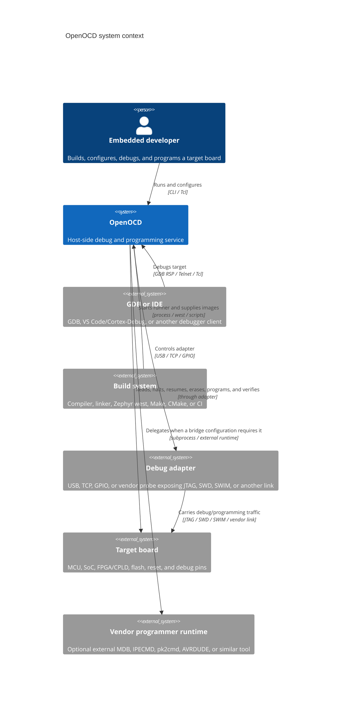

# C4 context: OpenOCD and its environment

OpenOCD is the system under design. It is a host process that converts
debugger/programmer requests into transport operations against a target board.
The target board and debug probe are external systems from OpenOCD's point of
view, even when they are physically connected by USB.

## External participants

| Participant | Interaction | Repository evidence |
|---|---|---|
| Embedded developer | Runs `openocd`, selects `-f` configs, or connects a debugger. | `src/main.c`, `src/helper/options.c`, `tcl/`, `examples/` |
| GDB or IDE | Uses the GDB Remote Serial Protocol; IDEs commonly launch OpenOCD and attach to its GDB port. | `src/server/gdb_server.c`, `docs/usage/debuggers.md` |
| Build system | Builds the firmware and invokes OpenOCD directly or through a runner such as Zephyr `west`. | `docs/getting-started/quickstart.md`, `docs/targets/`, `examples/vscode/` |
| Debug adapter | Presents a physical or network bridge to JTAG, SWD, SWIM, DAP, or a vendor protocol. | `src/jtag/drivers/`, `src/transport/`, `tcl/interface/` |
| Target board | Contains the CPU/debug port, memories, reset wiring, and optional FPGA/CPLD. | `src/target/`, `src/flash/`, `src/pld/`, `tcl/target/`, `tcl/board/` |
| Vendor runtime | Optional dependency for delegated programmer/debug-server flows. | `src/avr/backends/avrdude/`, `tools/debug-servers/`, `tcl/programmer/` |

## Protocol and port contract

The default TCP services are established by the server modules:

| Service | Default | Source | Purpose |
|---|---:|---|---|
| GDB server | `3333` | `src/server/gdb_server.c` | Debugger attach, registers, memory, run control, breakpoints, and flash programming through GDB. |
| Telnet server | `4444` | `src/server/telnet_server.c` | Interactive OpenOCD command shell. |
| Tcl server | `6666` | `src/server/tcl_server.c` | Scriptable command and target-event interface. |

Ports can be disabled or overridden in Tcl configuration. They are a runtime
contract, not a hardware transport: a client connects to OpenOCD over TCP, and
OpenOCD separately connects to the physical probe.
