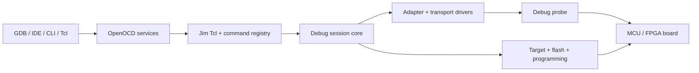

# Architecture

OpenOCD is a host-side debug and programming service. It accepts commands
from a CLI, GDB, Telnet, or the Tcl server, translates them through a common
command context, and drives a physical debug adapter and target device.

This section documents the repository from the source outward. The diagrams
use the [C4 model](https://c4model.com/) at four levels:

- **Context** — who and what surrounds OpenOCD.
- **Containers** — the logical runtime subsystems inside one OpenOCD process.
- **Components** — the main implementation responsibilities and their source
  boundaries.
- **Deployment** — where the executable, scripts, clients, probes, and target
  hardware live.

The term *container* is logical here. OpenOCD is normally one native executable;
the containers are maintainability boundaries, not separate processes.

## Read the model in this order

1. [System context](context.md) explains the external actors and protocols.
2. [Runtime containers](containers.md) explains the single-process runtime.
3. [Components and call flow](components.md) ties the model to C source files.
4. [Deployment view](deployment.md) explains native, Docker, package, and
   remote-debug layouts.
5. [Source map](source-map.md) is the contributor lookup table.
6. [Build and release](build-and-release.md) explains how source becomes an
   installed OpenOCD package.
7. [Architecture decisions](decisions.md) records the boundaries that should
   remain stable while the fork evolves.

## Architecture at a glance

## The most important boundary

OpenOCD deliberately separates **protocol and policy** from **hardware
mechanics**:

| Boundary | Source of truth | Why it matters |
|---|---|---|
| Host protocol | `src/server/` | GDB Remote Serial Protocol, Telnet, Tcl, and event delivery stay independent of probe details. |
| Command and scripting | `src/helper/command.c`, `src/helper/options.c`, `jimtcl/` | CLI options, Tcl commands, configuration files, and runtime extensions use one command context. |
| Link and adapter | `src/jtag/`, `src/transport/` | JTAG, SWD, SWIM, DAP-direct, HLA, USB, TCP, GPIO, and vendor adapters are selected at runtime. |
| Target semantics | `src/target/` | CPU registers, halt/resume, memory access, reset, breakpoints, SMP, RTOS, and debug architecture live above the physical link. |
| Non-volatile programming | `src/flash/`, `src/programmer/`, `src/avr/` | On-chip flash, NAND, AVR programming, Microchip programming, and external programmer bridges reuse target/link services. |
| Runtime composition | `tcl/`, `support/`, `svd/`, `examples/` | Board and probe combinations are composed from installed data rather than compiled into one board-specific executable. |

## Evidence and limits

The model is derived from the current source and build graph, especially:

- `src/main.c` and `src/openocd.c` for process startup and lifecycle;
- `src/Makefile.am` for the library composition;
- `src/helper/options.c` and `src/helper/configuration.c` for script discovery;
- `src/server/server.c` and the protocol-specific server files for services;
- `src/target/target.c`, `src/flash/nor/core.c`, and driver registries for
  extensibility;
- `configure.ac`, `Makefile.am`, `docker/`, and `.github/workflows/` for build
  and delivery boundaries.

The diagrams intentionally describe stable responsibilities, not every one of
the hundreds of individual target, flash, adapter, or board definitions.
Those detailed registries remain in the source and in the generated
[support matrix](../reference/support-matrix.md).
