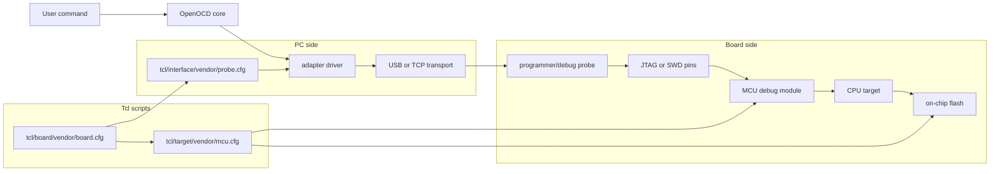
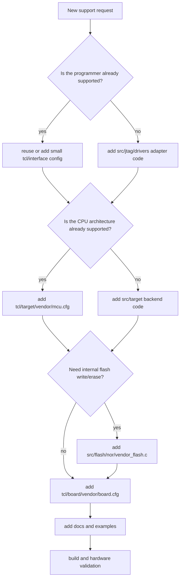
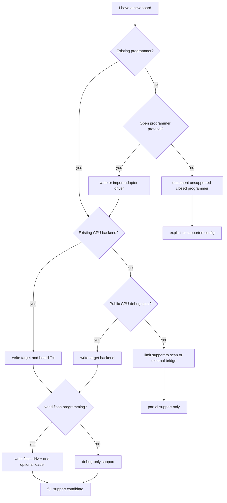
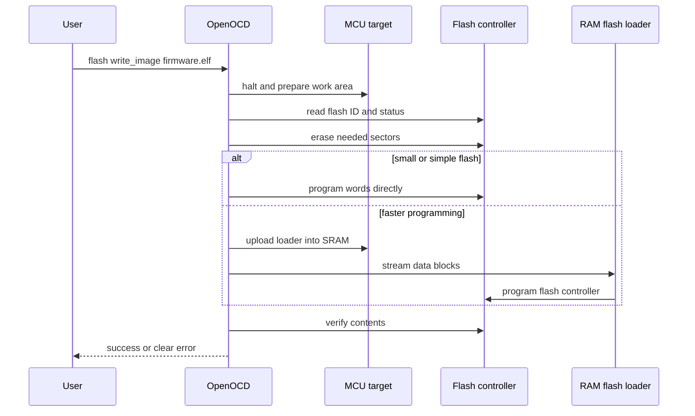
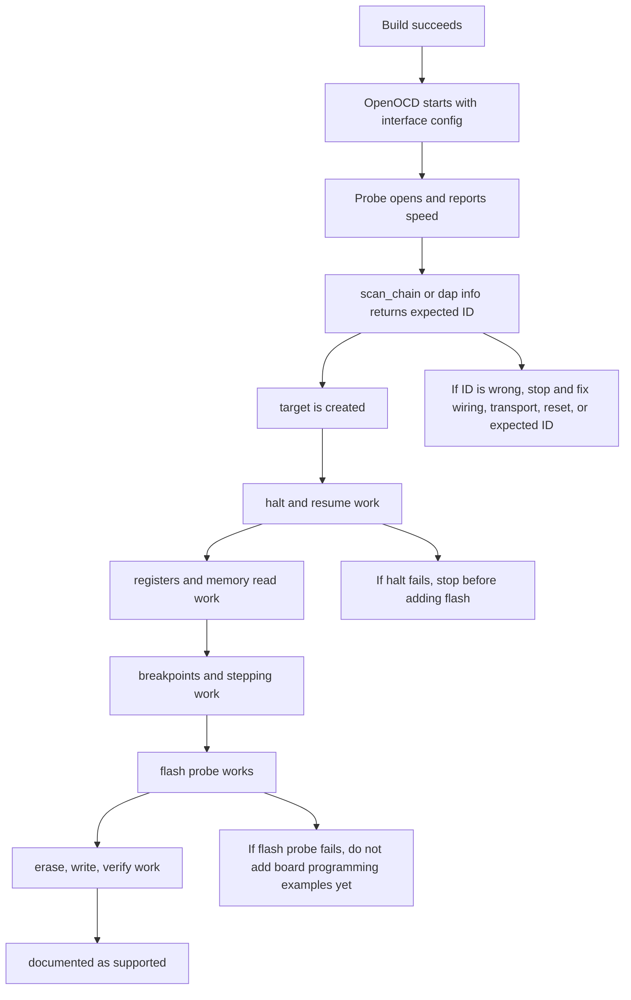

# Adding A New Vendor, MCU, And Programmer

This guide is for beginners who want to add real OpenOCD support for a new
microcontroller family and its programmer/debug probe. It explains the work in
small steps and shows where each piece belongs in this repository.

The short version:

1. Learn how the chip is debugged.
2. Learn how the programmer talks to the PC.
3. Add the programmer driver or interface script.
4. Add target and board scripts.
5. Add flash, reset, and memory support.
6. Build, test, document, and only then call it supported.

Do not start by copying a whole vendor fork over this repository. Add one
small, reviewable layer at a time.

## Words You Need First

| Word | Meaning |
| --- | --- |
| Programmer or probe | The USB device connected to the PC, for example CMSIS-DAP, ST-Link, J-Link, XDS, PICkit, or a vendor-specific adapter. |
| Adapter driver | C code in OpenOCD that knows how to talk to that programmer. |
| Interface config | Tcl file under `tcl/interface/` that selects and configures the adapter driver. |
| Transport | The electrical/debug protocol, usually JTAG or SWD. |
| Target | The CPU or debug module inside the MCU. Examples: Cortex-M, RISC-V, C28x, Xtensa. |
| Target config | Tcl file under `tcl/target/` that describes the MCU debug chain, memory, reset, and flash. |
| Board config | Tcl file under `tcl/board/` that combines one physical board, one programmer, and one target. |
| Flash driver | C code under `src/flash/nor/` that can erase, write, and protect on-chip flash. |

## Big Picture



Separate the PC-side programmer problem from the MCU-side target problem. A new
MCU can often use an existing programmer. A new programmer can often debug many
existing MCUs once its adapter driver works.

## Where Files Usually Go



Common locations:

| Need | Place |
| --- | --- |
| USB/JTAG/SWD adapter driver | `src/jtag/drivers/` |
| Adapter build registration | `src/jtag/drivers/Makefile.am`, `configure.ac`, relevant headers |
| Programmer Tcl config | `tcl/interface/<vendor>/` |
| MCU target script | `tcl/target/<vendor>/` |
| Board script | `tcl/board/<vendor>/` |
| Flash driver | `src/flash/nor/` |
| Flash driver registration | `src/flash/nor/Makefile.am`, `src/flash/nor/driver.h`, `src/flash/nor/drivers.c` |
| Flash helper loader | `contrib/loaders/flash/<vendor_or_mcu>/` |
| User documentation | `docs/targets/`, `docs/programmers/`, or `docs/development/` |
| Examples | `examples/<vendor_or_family>/` |

## Step 1: Collect Information

Before writing code, collect enough information to avoid guessing.

Minimum information for a new MCU:

| Question | Example answer |
| --- | --- |
| CPU architecture | Arm Cortex-M33, RISC-V, Xtensa, C28x |
| Debug protocol | SWD, JTAG, cJTAG, vendor protocol |
| TAP or DAP IDs | JTAG IDCODE, ARM DPIDR, RISC-V IDCODE |
| Memory map | Flash base, SRAM base, peripheral base |
| Reset behavior | SRST, SYSRESETREQ, watchdog, boot pins |
| Flash algorithm | Erase sectors, program alignment, lock bits |
| Reference documents | Datasheet, reference manual, vendor SDK, public headers |

Minimum information for a new programmer:

| Question | Example answer |
| --- | --- |
| Host connection | USB bulk endpoints, HID, WinUSB, libusb, TCP |
| Transport produced | SWD, JTAG, GPIO bitbang, vendor debug transport |
| Public protocol? | CMSIS-DAP is public; some vendor protocols are closed |
| USB IDs | VID, PID, interface number |
| Existing driver model | FTDI MPSSE, CMSIS-DAP, HID, libusb custom |
| Reset pins | nSRST, nTRST, power control, voltage sense |

If the only available implementation is closed-source vendor software, document
that limit. Do not claim full OpenOCD support until OpenOCD can drive the
hardware directly.

## Step 2: Decide The Integration Type



Use these support levels:

| Level | What works |
| --- | --- |
| Discovery | OpenOCD can see the programmer or scan a JTAG/SWD ID. |
| Attach | OpenOCD can create the target and connect without errors. |
| Debug | Halt, resume, step, registers, breakpoints, and memory reads work. |
| Flash | Erase, write, verify, protect, and unlock work. |
| Production ready | Build tests, hardware tests, docs, examples, and failure messages are done. |

## Step 3: Add The Programmer

Start with the least invasive route.

1. If the probe is FTDI-based, add a Tcl config under `tcl/interface/ftdi/` or
   `tcl/interface/<vendor>/`.
2. If the probe speaks CMSIS-DAP, try `interface/cmsis-dap.cfg` first.
3. If the probe speaks J-Link, ST-Link, KitProg, or another existing backend,
   add only a board or interface wrapper.
4. If the probe has a new public protocol, add a C adapter driver.
5. If the protocol is closed, add an explicit unsupported config that explains
   why it cannot work locally.

Adapter driver work usually touches:

| File | Purpose |
| --- | --- |
| `src/jtag/drivers/<probe>.c` | Main adapter implementation. |
| `src/jtag/drivers/Makefile.am` | Builds the new file. |
| `configure.ac` | Adds `--enable-<probe>` and dependency checks. |
| `tcl/interface/<vendor>/<probe>.cfg` | User-facing config. |
| `udev/*.rules` or Windows packaging docs | Host driver permissions. |

Keep the first version simple: open the probe, set speed, select transport,
scan the chain, and close cleanly.

## Step 4: Add The MCU Target

If the CPU is already supported, the first useful target file is often small:

```tcl
# SPDX-License-Identifier: GPL-2.0-or-later

if { ![info exists CHIPNAME] } {
	set CHIPNAME example123
}

source [find target/swj-dp.tcl]
transport select swd

swj_newdap $CHIPNAME cpu -expected-id 0x12345678
dap create $CHIPNAME.dap -chain-position $CHIPNAME.cpu

set _TARGETNAME $CHIPNAME.cpu
target create $_TARGETNAME cortex_m -dap $CHIPNAME.dap

$_TARGETNAME configure -work-area-phys 0x20000000 \
	-work-area-size 0x4000 -work-area-backup 0
```

Adjust this to the real architecture and existing OpenOCD patterns. Do not copy
an unrelated vendor file just because it loads.

Target script checklist:

| Item | Done when |
| --- | --- |
| Debug chain | `scan_chain` shows the expected TAP or DAP ID. |
| Target creation | `targets` lists the target. |
| Reset | `reset halt` behaves predictably or documents why it cannot. |
| Work area | RAM address and size are real for this MCU. |
| Flash bank | Flash driver is declared only after it works. |
| Variants | Different flash/RAM/package variants are handled by variables or separate files. |

## Step 5: Add Flash Support

Flash support is where many beginner ports become fragile. Treat it as a
separate project after basic debug works.



Flash driver checklist:

| Item | Beginner explanation |
| --- | --- |
| Probe | Detect the exact flash or MCU variant before writing. |
| Erase | Know sector sizes and erase alignment. |
| Program | Know write granularity, such as byte, halfword, word, row, or page. |
| Busy wait | Poll the real busy bit and time out with a helpful error. |
| Protect | Respect lock bits and report protected sectors clearly. |
| Verify | Read back and compare data. |
| Failure safety | Never keep writing after an erase or program error. |

## Step 6: Build Registration

When you add C code, make sure it is actually compiled.

Typical build registration path:


For an adapter, the registry is in the JTAG adapter layer. For a flash driver,
the registry is usually `src/flash/nor/drivers.c`.

After editing build files, run at least one native build and one Windows
packaging build if this repository's Windows package is affected.

## Step 7: Add Beginner-Friendly Configs

Provide three levels of Tcl files when possible:

| File type | Example | Purpose |
| --- | --- | --- |
| Interface | `interface/vendor/probe.cfg` | Only configures the programmer. |
| Target | `target/vendor/mcu_family.cfg` | Only configures the MCU. |
| Board | `board/vendor/devkit-probe.cfg` | Combines the real board and real programmer. |

Good board files are boring and predictable. They should not automatically
erase flash or change security state. If they run `init` or `reset halt`, the
reason should be very clear.

## Step 8: Validate In Stages



Suggested commands:

```console
openocd -s ./tcl -f interface/vendor/probe.cfg -c "adapter speed 1000" -c "transport select swd" -c "init; shutdown"
openocd -s ./tcl -f interface/vendor/probe.cfg -f target/vendor/mcu.cfg -c "init; targets; shutdown"
openocd -s ./tcl -f board/vendor/devkit-probe.cfg -c "init; reset halt"
openocd -s ./tcl -f board/vendor/devkit-probe.cfg -c "init; flash banks; shutdown"
```

Use low adapter speed first. Increase speed only after basic attach is stable.

## Step 9: Write Clear Errors

Beginners need errors that say what to do next. Prefer:

```text
This probe family uses a closed vendor protocol and is not supported by this
OpenOCD build. Use a CMSIS-DAP, J-Link, or the vendor debug server bridge.
```

over:

```text
adapter init failed
```

Helpful error messages mention:

| Error area | Useful hint |
| --- | --- |
| USB open failed | Driver binding, permissions, VID/PID, interface number. |
| Wrong IDCODE | Wrong transport, reset pin held, target unpowered, bad expected ID. |
| Halt failed | Boot mode, debug lock, watchdog, reset strategy. |
| Flash failed | Protected sectors, wrong flash size, voltage, alignment. |

## Step 10: Document The Result

Add user docs when the feature can be tried by someone else.

Documentation checklist:

| Section | Include |
| --- | --- |
| Supported hardware | Exact MCU variants, boards, and programmers tested. |
| Build flags | Required `./configure` options. |
| Host setup | udev rules, WinUSB/Zadig/libusb notes, serial interface warnings. |
| First command | A copy-paste command that only attaches or scans. |
| Debug command | A command for `reset halt`, GDB, or telnet use. |
| Flash command | Only after flash was tested. |
| Known limits | Missing flash, reset quirks, closed protocols, locked devices. |
| Validation log | Date, board, probe, OS, OpenOCD command, result. |

## A Practical First Pull Request

For a new vendor, MCU, and programmer, a good first PR is not "everything".
Use this order:

1. Add an unsupported or discovery-only programmer config if the protocol is
   uncertain.
2. Add a minimal interface config and prove the probe opens.
3. Add a minimal target config and prove ID scan works.
4. Add target attach and debug operations.
5. Add flash probe.
6. Add flash erase/write/verify.
7. Add board files and beginner docs.

Each step should leave the tree better than before, even if full support is not
finished yet.

## Phased Checklist From The Vendor Audit

The standalone checklist lives in
[`vendor-audit-phased-checklist.md`](vendor-audit-phased-checklist.md).

Use this checklist to turn the repository audit into small, checkable work.
Each phase should end with a build or hardware result that proves the tree did
not move backwards.

### Phase 0: Pick One Lane

- [x] Choose one ecosystem from the audit: TI, Microchip, Espressif, WCH,
  Nuvoton, RISC-V, or another listed source.
- [x] Write down the exact goal: new board config, new MCU target, new flash
  driver, new programmer, or full support.
- [x] Record the upstream source, branch or tag, license, and commit ID.
- [x] Confirm whether the work is config-only or requires C backend changes.
- [x] Reject any plan that copies a whole fork over this tree.

Phase 0 result:

| Field | Decision |
| --- | --- |
| Ecosystem | Texas Instruments |
| Lane | TI hardware path from the audit queue |
| Exact goal | Finish the XDS100v2/XDS100v3/XDS110 attach and packaging path for TI C2000, with F28M35x dual-core discovery as the first hardware target and C28x target creation tests as the acceptance gate. |
| User-visible deliverables | Reliable example commands, board/target/interface docs, Windows driver-binding notes, and recorded validation logs for XDS100-family probes. |
| Upstream source | `https://github.com/TexasInstruments/ti-openocd` |
| Branch or tag | TI release branch to be pinned during Phase 1 source triage. |
| License | OpenOCD-compatible GPL source lineage; verify SPDX/license headers on every imported file during Phase 1. |
| Commit ID | Not present in the current local audit snapshot; Phase 1 must refresh the audit artifacts and pin the exact upstream commit before importing files. |
| Integration type | Not config-only. This lane includes Tcl config and docs plus C backend validation for XDS100/XDS110/C28x behavior. |
| Fork-copy decision | Do not copy the TI fork wholesale. Import only reviewed files or small focused backend changes with local build and hardware validation. |

### Phase 1: Source Triage

- [x] Run or refresh the vendor audit output and pin the exact TI upstream
  commit ID.
- [x] List new Tcl interface, target, and board files that are not present
  locally.
- [x] List modified C adapter, target, and flash backend files.
- [x] Mark files as one of: importable config, backend batch, duplicate,
  obsolete, or unsupported closed protocol.
- [x] Open every file planned for import and check SPDX or license headers.
- [x] Create a short note explaining why this batch is useful.

Phase 1 result:

| Field | Decision |
| --- | --- |
| Triage note | `docs/development/vendor-audit-phase1-ti-triage.md` |
| Audit CSV | `artifacts/vendor-audit/openocd-vendor-file-delta.csv` |
| TI upstream commit | `cb22a31e503b39820f0c758531cb9949300d014c` |
| TI upstream tag | `ti-v1.5.0.75` |
| Immediate config imports | None. Relevant TI Tcl files are already present locally after path normalization. |
| Backend candidates | `src/jtag/drivers/xds110.c`; review `src/jtag/drivers/ftdi.c` only if XDS100v2/v3 hardware tests point there. |
| Next phase focus | Config-load and example validation for existing TI C2000/XDS100 files, not broad file import. |

### Phase 2: Config-Only Imports

- [x] Import small standalone Tcl files first.
- [x] Normalize paths to this repository's layout, such as `tcl/target/<vendor>`
  and `tcl/board/<vendor>`.
- [x] Avoid Tcl files that reference missing custom C target types or flash
  drivers.
- [x] Add a dummy-adapter config-load command for every new target or board
  family where possible.
- [x] Add user-facing docs for how to try the config.
- [x] Record commands and results in the relevant docs page.

Phase 2 result:

| Field | Decision |
| --- | --- |
| Result note | `docs/development/vendor-audit-phase2-ti-config.md` |
| Config imports | None selected; relevant TI Tcl files are already present after path normalization. |
| Validation | All six `examples/c2000/*xds100*.cfg` files, two `examples/program-xds100.cfg` variable combinations, and three target-only dummy-adapter checks passed. |
| Documentation | Fixed XDS100 wrapper examples so variables are set before `-f examples/program-xds100.cfg`. |
| Next phase focus | Programmer backend confirmation for FTDI-based XDS100v2/v3 and XDS110. |

### Phase 3: Programmer Backend

- [x] Decide whether the programmer can use an existing backend such as FTDI,
  CMSIS-DAP, J-Link, ST-Link, KitProg, Nu-Link, or XDS110.
- [x] If existing, add only the smallest interface wrapper needed.
- [x] If new, add the adapter C driver under `src/jtag/drivers/`.
- [x] Register the driver in build files and configure options.
- [x] Add USB VID/PID, interface, speed, reset, and transport handling.
- [x] Test probe open, speed set, transport select, and clean shutdown.
- [x] Document Linux udev and Windows driver binding requirements.

Phase 3 result:

| Field | Decision |
| --- | --- |
| Result note | `docs/development/vendor-audit-phase3-ti-programmer.md` |
| Programmer backends | Existing `ftdi` for XDS100v2/v3 and existing native `xds110` for XDS110. |
| New adapter driver | None needed. |
| Build/config validation | `adapter ti list` reports XDS100v2, XDS100v3, and XDS110 as built. |
| Hardware-open result | Adapter-open commands were run; no accessible probe/driver binding was available in this session. |
| Documentation | Added `docs/usage/xds110.md`; XDS100 docs already existed. |
| udev | Added XDS110 IDs to `udev/99-openocd-probes.rules`. |
| Next phase focus | Hardware target attach and F28M35x/C2000 discovery through the selected probe. |

### Phase 4: MCU Target Attach

- [ ] Identify the CPU architecture and confirm OpenOCD has a target backend
  for it.
- [ ] Add the target Tcl file with real TAP, DAP, or debug-module IDs.
- [ ] Define work-area RAM only after checking the memory map.
- [ ] Prove `scan_chain`, `dap info`, or the target equivalent returns the
  expected ID.
- [ ] Prove `targets` lists the expected target.
- [ ] Prove halt, resume, step, register read, and memory read.
- [ ] Document reset quirks, boot-mode requirements, and debug lock behavior.

### Phase 5: Flash Support

- [ ] Decide whether an existing flash driver can be reused.
- [ ] If new, add the flash driver under `src/flash/nor/`.
- [ ] Register the flash driver in `Makefile.am`, `driver.h`, and `drivers.c`.
- [ ] Add any required RAM loader under `contrib/loaders/flash/`.
- [ ] Prove flash probe reports the expected device or MCU variant.
- [ ] Prove erase, write, verify, protect, and unlock behavior.
- [ ] Test failure cases such as protected sectors and wrong alignment.
- [ ] Add flash examples only after real hardware verification.

### Phase 6: Board Files And Examples

- [ ] Add board files that combine the real programmer and target.
- [ ] Keep board files non-destructive by default.
- [ ] Add examples under `examples/<vendor_or_family>/` when they help users.
- [ ] Include low-speed first-attach commands for unstable or new hardware.
- [ ] Include a GDB or telnet workflow when debug support is ready.
- [ ] Include flash commands only when flash support is verified.

### Phase 7: Build And Regression Validation

- [ ] Run a native build with the required configure flags.
- [ ] Run the Windows package build if the feature affects Windows users.
- [ ] Run config-load checks for all new scripts.
- [ ] Run hardware attach checks on the real board and programmer.
- [ ] Run flash checks on sacrificial or recoverable hardware.
- [ ] Check that unrelated existing board configs still load.
- [ ] Save exact commands and results in documentation.

### Phase 8: Documentation And Support Status

- [ ] Add or update target docs under `docs/targets/`.
- [ ] Add or update programmer docs under `docs/programmers/`.
- [ ] Add development notes when the support is partial or experimental.
- [ ] State exact tested hardware, OS, probe firmware, and OpenOCD command.
- [ ] State known limits clearly, especially closed protocols and unverified
  flash operations.
- [ ] Update `docs/index.md` if the page is user-facing.
- [ ] Update the vendor audit page with the integration decision.

### Phase 9: Current Audit Queue

Use the latest audit snapshot to choose the next batch:

- [ ] TI hardware path: finish XDS100v2/XDS100v3/XDS110 packaging, attach flow,
  and C28x target creation tests.
- [ ] Espressif backend batch: import ESP32-C5, ESP32-C61, ESP32-P4, H21, H4,
  or S31 only with their required C target and flash backend changes.
- [ ] WCH backend batch: import CH32 support only with WCH adapter, transport,
  target, and flash code together.
- [ ] Nuvoton backend batch: update `numicro.c` flash-region handling before
  adding M23 and M23_NS target aliases.
- [ ] Zephyr SDK deferred targets: handle `rv32m1` or `nds32` only after
  deciding whether their target backends belong in this fork.
- [ ] RISC-V collaboration: review core RISC-V behavior after MCU-specific
  imports, because regressions affect many targets.
- [ ] Arduino OpenOCD: import only after deciding whether old NDS32/package flow
  files are still useful.
- [ ] Microchip, ST, Nordic, NXP, Silicon Labs, GigaDevice, and Raspberry Pi:
  leave as covered unless a newer source adds a self-contained, tested file.

## What Full Support Means

Call the port "full support" only when this table is true:

| Area | Requirement |
| --- | --- |
| Programmer | Opens reliably on Linux and Windows or documents OS limits. |
| Transport | JTAG/SWD speed, reset pins, and scan behavior are stable. |
| Target | Halt, resume, step, registers, memory, and breakpoints work. |
| Flash | Probe, erase, write, verify, protect, and error paths work. |
| Configs | Interface, target, and board files are small and reusable. |
| Build | Native and package builds include the new code. |
| Tests | Config-load tests plus hardware validation are recorded. |
| Docs | Beginner commands and known limits are documented. |
| Licensing | Imported code has compatible license and provenance. |

## Infographic Sources

The Mermaid source files used by this guide are stored in:

- `docs/development/infographics/new-vendor-openocd-architecture.mmd`
- `docs/development/infographics/new-vendor-file-decision-tree.mmd`
- `docs/development/infographics/new-vendor-flash-sequence.mmd`
- `docs/development/infographics/new-vendor-build-registration.mmd`
- `docs/development/infographics/new-vendor-validation-ladder.mmd`

Install Mermaid CLI later if you want exported images:

```console
npm install -g @mermaid-js/mermaid-cli
mmdc -i docs/development/infographics/new-vendor-openocd-architecture.mmd -o artifacts/new-vendor-openocd-architecture.svg
```
