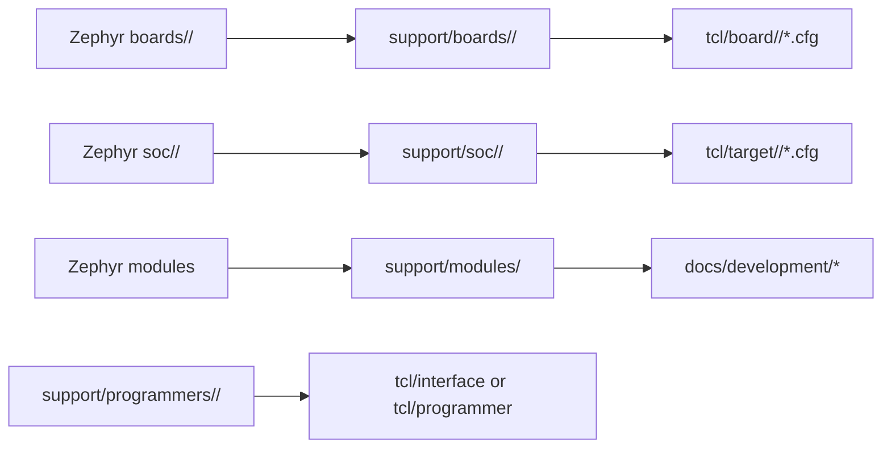
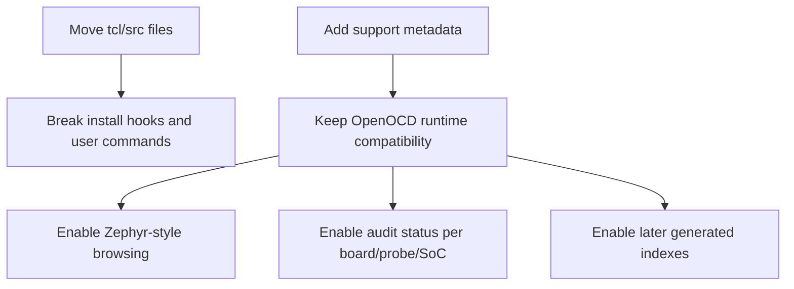

# Zephyr-Style Support Organization

This tree now has a Zephyr-inspired support index under `support/`.

Zephyr commonly organizes hardware support around vendor-scoped board and SoC
roots, such as `boards/<vendor>/<board>` and `soc/<vendor>/<soc>`, with
metadata files and optional board documentation. OpenOCD cannot directly adopt
Zephyr's build system layout because OpenOCD installs runtime scripts from
`tcl/` and builds C backends from `src/`. Instead, this fork uses the same
human-facing organization as an audit and packaging layer.

## Mapping

## Directory Contract

| Directory | Role |
| --- | --- |
| `support/boards/<vendor>/<board>/` | One physical board or board/probe pairing. |
| `support/soc/<vendor>/<soc>/` | One MCU, SoC, or target family. |
| `support/programmers/<vendor>/<programmer>/` | One debug probe, programmer, or external bridge. |
| `support/modules/<source>/` | One external source, tool, or import lane. |
| `support/vendors/<vendor>/` | Vendor-level ownership and docs entry point. |

## First Indexed Entries

| Entry | Status | Runtime files |
| --- | --- | --- |
| `support/soc/ti/tms320f280049/` | Experimental | `tcl/target/ti/tms320f280049.cfg` |
| `support/soc/ti/tms320f28069/` | Experimental | `tcl/target/ti/tms320f28069.cfg` |
| `support/soc/ti/tms320f28m35x/` | Experimental | `tcl/target/ti/tms320f28m35x.cfg` |
| `support/boards/ti/tms320f280049-xds100v2/` | Experimental | `tcl/board/ti/tms320f280049-xds100v2.cfg` |
| `support/boards/ti/tms320f280049-xds100v3/` | Experimental | `tcl/board/ti/tms320f280049-xds100v3.cfg` |
| `support/boards/ti/tms320f28069-xds100v2/` | Experimental | `tcl/board/ti/tms320f28069-xds100v2.cfg` |
| `support/boards/ti/tms320f28069-xds100v3/` | Experimental | `tcl/board/ti/tms320f28069-xds100v3.cfg` |
| `support/boards/ti/tms320f28m35x-xds100v2/` | Experimental | `tcl/board/ti/tms320f28m35x-xds100v2.cfg` |
| `support/boards/ti/tms320f28m35x-xds100v3/` | Experimental | `tcl/board/ti/tms320f28m35x-xds100v3.cfg` |
| `support/programmers/ti/xds100v2/` | Integrated | `tcl/interface/ti/xds100v2.cfg` |
| `support/programmers/ti/xds100v3/` | Integrated | `tcl/interface/ti/xds100v3.cfg` |
| `support/programmers/ti/xds110/` | Integrated | `tcl/interface/ti/xds110.cfg` |
| `support/programmers/avrdude/bridge/` | Delegated | `tcl/programmer/avrdude/common.tcl` |
| `support/modules/avrdude/` | Delegated | `docs/development/avrdude-integration-audit.md` |

## Why Metadata Instead Of Moving Files

The OpenOCD-compatible runtime paths remain canonical for execution. The
Zephyr-style `support/` entries are canonical for organization, status, and
review.
