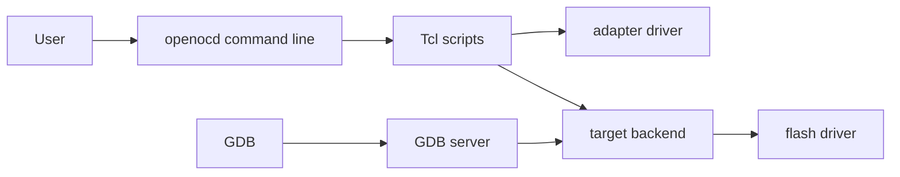

# Lab 02: OpenOCD Architecture Map

## Objective

Build a mental model of OpenOCD's layers and the files that implement them.

## Safety

No hardware commands are required.

## Tasks

1. Read the top-level directories `src`, `tcl`, `doc`, `docs`, `contrib`, and
   `support`.
2. Map each directory to one OpenOCD responsibility.
3. Draw an architecture diagram that includes user commands, Tcl scripts,
   adapter drivers, transports, targets, flash drivers, and GDB.
4. Identify which layer a board config belongs to.

## Starter Diagram

## Checkpoints

- You can explain why a board file should compose existing interface and target
  files instead of duplicating them.
- You can point to one C backend and one Tcl runtime script.

## Deliverables

- Annotated architecture diagram
- Directory responsibility table

## 30-Minute Session Plan

| Time | Activity |
| ---: | --- |
| 0-4 min | Review the OpenOCD layers: CLI, Tcl, adapter, transport, target, flash, servers. |
| 4-10 min | Students inspect top-level directories and assign each to a layer. |
| 10-18 min | Draw the architecture diagram from user command to target memory. |
| 18-23 min | Add examples from this repo to every box in the diagram. |
| 23-27 min | Discuss where errors can originate and why one message may cross layers. |
| 27-30 min | Exit ticket. |

## Instructor Prompts

- Which layer owns USB communication?
- Which layer owns target halt/resume behavior?
- Why does a board file belong in the composition layer?

## Exit Ticket

Name one file path for a Tcl script and one file path for a C backend.
