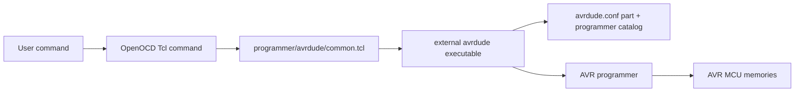
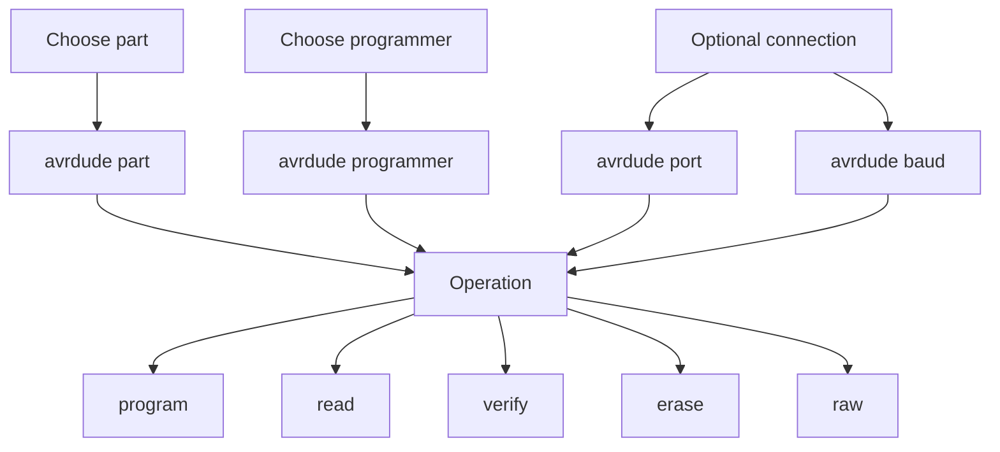

# AVRDUDE Programmer Bridge

This OpenOCD fork includes a source-level AVRDUDE catalog import and a Tcl
bridge for using AVRDUDE from an OpenOCD session. It is intended for AVR
programming workflows where AVRDUDE already supports the MCU and programmer.

The bridge does not turn AVRDUDE protocols into native OpenOCD debug targets.
It delegates programming operations to the external `avrdude` executable while
OpenOCD keeps a consistent command surface for scripts, packages, and examples.

## What This Supports

| Item | Status |
| --- | --- |
| AVRDUDE MCU catalog | Compiled into OpenOCD as `avrdude_catalog`; runtime operations still use the selected AVRDUDE binary |
| AVRDUDE programmer catalog | Compiled into OpenOCD as `avrdude_catalog`; runtime operations still use the selected AVRDUDE binary |
| Flash write/read/verify/erase | Supported through `-U` and `-e` operations |
| EEPROM write/read/verify | Supported by selecting `eeprom` memory |
| Fuse and lock bits | Available only through explicit `avrdude raw ...` commands |
| OpenOCD halt/resume/register debug | Not provided by this bridge |
| Native OpenOCD AVR protocol drivers | Deferred to audited backend batches |

The upstream AVRDUDE audit snapshot from July 21, 2026 found 406 part blocks
and 174 programmer blocks in `src/avrdude.conf.in`.

This tree also keeps a generated support index under
`support/catalogs/avrdude/`. Regenerate it from an installed AVRDUDE or source
checkout with:

```powershell
powershell -ExecutionPolicy Bypass -File tools\support\generate-avrdude-catalog.ps1 -Config path\to\avrdude.conf
```

The generated catalog is also compiled into OpenOCD under `src/avrdude/`.
The selected installed AVRDUDE binary still decides the exact part and
programmer support available for delegated runtime programming.

Query the compiled catalog without loading the Tcl bridge:

```powershell
openocd -c "avrdude_catalog summary" -c shutdown
openocd -c "avrdude_catalog parts atmega328p" -c shutdown
openocd -c "avrdude_catalog programmers usbasp" -c shutdown
```

## Flow



## Basic Arduino Uno Example

```powershell
openocd -f programmer/avrdude/common.tcl `
  -c "avrdude programmer arduino" `
  -c "avrdude part atmega328p" `
  -c "avrdude port COM1" `
  -c "avrdude baud 115200" `
  -c "avrdude program blink.hex" `
  -c shutdown
```

This builds and runs:

```text
avrdude -c arduino -p atmega328p -P COM1 -b 115200 -U flash:w:blink.hex:i
```

## USBasp Example

```powershell
openocd -f programmer/avrdude/common.tcl `
  -c "avrdude programmer usbasp" `
  -c "avrdude part atmega328p" `
  -c "avrdude program app.hex" `
  -c shutdown
```

## Read EEPROM

```powershell
openocd -f programmer/avrdude/common.tcl `
  -c "avrdude programmer usbasp" `
  -c "avrdude part atmega328p" `
  -c "avrdude read eeprom eeprom.hex i" `
  -c shutdown
```

## Dry Run

Use `dry_run on` to print the command without touching hardware:

```powershell
openocd -f programmer/avrdude/common.tcl `
  -c "avrdude dry_run on" `
  -c "avrdude programmer arduino" `
  -c "avrdude part atmega328p" `
  -c "avrdude port COM1" `
  -c "avrdude baud 115200" `
  -c "avrdude program blink.hex" `
  -c shutdown
```

## Command Map



Available OpenOCD commands:

```text
avrdude executable auto|<path>
avrdude programmer <id>
avrdude part <id>
avrdude port none|<port>
avrdude baud none|<baud>
avrdude config none|<avrdude.conf>
avrdude disable_auto_erase on|off
avrdude verbose on|off
avrdude dry_run on|off
avrdude working_directory none|<path>
avrdude option clear|<single-avrdude-option>
avrdude show
avrdude command program|read|verify|erase|raw <args...>
avrdude program <file> [memory] [format]
avrdude read <memory> <file> [format]
avrdude verify <file> [memory] [format]
avrdude erase
avrdude raw <avrdude-args...>
```

## Memory Operations

| OpenOCD bridge command | AVRDUDE operation |
| --- | --- |
| `avrdude program app.hex` | `-U flash:w:app.hex:i` |
| `avrdude program data.hex eeprom i` | `-U eeprom:w:data.hex:i` |
| `avrdude read flash flash.hex i` | `-U flash:r:flash.hex:i` |
| `avrdude verify app.hex` | `-U flash:v:app.hex:i` |
| `avrdude erase` | `-e` |

## Fuse And Lock Bits

Fuse and lock-bit writes can permanently change boot, clock, reset, or debug
behavior. The bridge does not provide friendly fuse helper commands yet. Use
the explicit raw escape hatch only when you know the exact AVRDUDE command:

```powershell
openocd -f programmer/avrdude/common.tcl `
  -c "avrdude programmer usbasp" `
  -c "avrdude part atmega328p" `
  -c "avrdude raw -U lfuse:r:lfuse.hex:i" `
  -c shutdown
```

## Troubleshooting

| Symptom | Check |
| --- | --- |
| `avrdude` is not found | Set `AVRDUDE` in the environment or use `avrdude executable <path>` |
| Wrong MCU name | Run AVRDUDE directly to list supported parts for your installed version |
| Wrong programmer name | Use the exact AVRDUDE programmer ID, such as `arduino`, `usbasp`, or `serialupdi` |
| Serial bootloader timeout | Confirm `avrdude port`, `avrdude baud`, reset wiring, and bootloader baud rate |
| USB programmer permission error | Fix OS driver binding or udev permissions for the AVR programmer |
| Need custom `avrdude.conf` | Use `avrdude config <path>` |

## Native-Port Roadmap


Native OpenOCD support should be added one protocol family at a time. Good
candidate batches are ISP/STK500, UPDI, TPI/PDI, USBasp/USBtiny, AVR JTAG and
debugWIRE, FTDI bitbang, Linux GPIO/SPI, and serial bootloader protocols.
