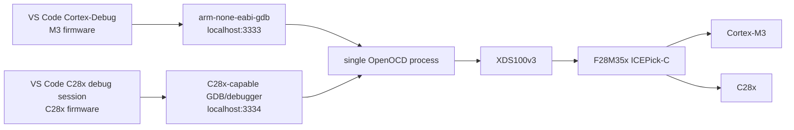

# VS Code Dual-Core Debug For TI F28M35x

F28M35x Concerto devices contain a Cortex-M3 subsystem and a C28x/C2000
subsystem behind a TI ICEPick-C JTAG router. The correct parallel-debug shape
is:

```text
one XDS100v3 USB probe
one OpenOCD process
two OpenOCD targets
two GDB ports
two VS Code debug sessions
```

Do not start two OpenOCD processes for one XDS100v3. Only one process can own
the USB/JTAG probe.

## Current Repository Status

The current `target/ti/tms320f28m35x.cfg` creates the C28x target endpoint and
ICEPick discovery helpers. The Cortex-M3 path still needs hardware-discovered
secondary-TAP routing before it can be marked supported.

Use this command first:

```powershell
.\artifacts\windows\openocd-windows-x86_64\openocd-xds100v3.cmd `
  -f board/ti/tms320f28m35x-xds100v3.cfg `
  -c "init; scan_chain; c2000_icepick_read_idcode; c2000_icepick_read_code; c2000_icepick_scan_sdtaps"
```

Keep that OpenOCD session open and record the SDTAP output.

## Parallel Debug Model



## VS Code Compound Shape

Use a compound launch only after OpenOCD exposes both targets.
For the shared PIC, AVR, C2000 and generic multi-core launch templates, see
`tools/vscode/cortex-debug/support/openocd-mcu-launch-examples.json` and
`docs/usage/vscode-cortex-debug-openocd-mcus.md`.

```json
{
  "version": "0.2.0",
  "compounds": [
    {
      "name": "F28M35x: M3 + C28x",
      "configurations": [
        "F28M35x Cortex-M3",
        "F28M35x C28x"
      ],
      "stopAll": true
    }
  ],
  "configurations": [
    {
      "name": "F28M35x Cortex-M3",
      "type": "cortex-debug",
      "request": "attach",
      "servertype": "external",
      "cwd": "${workspaceFolder}",
      "executable": "${workspaceFolder}/build/m3.elf",
      "gdbPath": "arm-none-eabi-gdb",
      "gdbTarget": "localhost:3333",
      "runToEntryPoint": "main",
      "showDevDebugOutput": "raw"
    },
    {
      "name": "F28M35x C28x",
      "type": "cppdbg",
      "request": "launch",
      "cwd": "${workspaceFolder}",
      "program": "${workspaceFolder}/build/c28x.out",
      "MIMode": "gdb",
      "miDebuggerPath": "path/to/c28x-capable-gdb.exe",
      "miDebuggerServerAddress": "localhost:3334",
      "stopAtEntry": true
    }
  ]
}
```

Notes:

- Cortex-Debug is appropriate for the Cortex-M3 session.
- Cortex-Debug is not appropriate for the C28x session.
- The C28x session requires a C28x-capable GDB/debug adapter frontend. If your
  TI toolchain does not provide GDB for C28x, use CCS or another TI-capable
  debug frontend for that core.
- Both sessions must attach to the same OpenOCD process through different GDB
  ports.

## OpenOCD Target Requirements

OpenOCD must create both targets before VS Code can attach:

```text
tms320f28m35x.m3    cortex_m    localhost:3333
tms320f28m35x.c28x  c28x        localhost:3334
```

The repository does not yet claim this dual-target setup as validated. The M3
secondary TAP must be identified on real hardware first, then the target config
can safely create a Cortex-M DAP/target for it.

## Bring-Up Order

1. Fix XDS100v3 WinUSB binding for `VID_0403&PID_A6D1&MI_00`.
2. Start one OpenOCD process.
3. Run ICEPick discovery.
4. Confirm which SDTAP is the Cortex-M3 and which is C28x.
5. Add or enable both target definitions in one OpenOCD config.
6. Confirm `targets` lists both cores.
7. Confirm OpenOCD opens two GDB ports.
8. Attach VS Code Cortex-Debug to the M3 port.
9. Attach the C28x debugger to the C28x port.

## First Evidence To Capture

```text
scan_chain
c2000_icepick_read_idcode
c2000_icepick_read_code
c2000_icepick_scan_sdtaps
targets
```

Paste those results into the issue or support note before changing flash,
reset, or memory settings.
