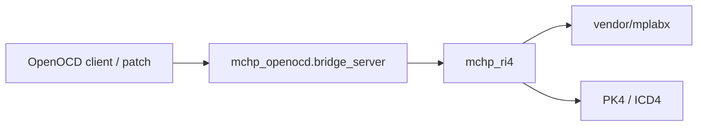
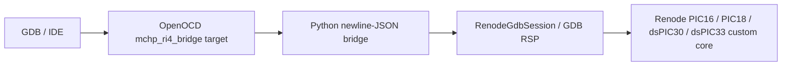

# OpenOCD Integration

This repository now includes a TCP bridge for OpenOCD-facing integrations:

## Integration Role

The OpenOCD bridge exists so OpenOCD-facing workflows can reuse the repo's clean-room RI4 family registry and session controls instead of duplicating Microchip-specific family logic inside OpenOCD itself.



- Start the bridge with `python -m mchp_openocd.bridge_server --host 127.0.0.1 --port 9123`
- Query the bridge inventory with `python -m mchp_openocd.query_bridge list-families ...` or `mchp-openocd-query list-families ...`
- Drive bridge probe/session operations with `python -m mchp_openocd.query_bridge probe-tool ...`, `start-session ...`, `session-status`, `end-session`, `run-script`, `enter-debug-mode`, `get-pc`, `set-pc`, `run`, `step`, `halt`, `program-hex`, `read-program`, and `batch`
- The bridge exposes JSON-line commands for:
  - `listFamilies`
  - `probeTool`
  - `startSession`
  - `sessionStatus`
  - `capabilities`
  - `targetStatus`
  - `endSession`
  - `runScript`
  - `enterDebugMode`
  - `exitDebugMode`
  - `getPc`
  - `setPc`
  - `run`
  - `step`
  - `halt`
  - `reset`
  - `erase`
  - `programHex`
  - `verifyHex`
  - `readProgram`
  - `writeProgram`
  - `addBreakpoint` / `removeBreakpoint`
  - `addWatchpoint` / `removeWatchpoint`

The maintained OpenOCD target lives under `openocd/overlay/`. Install it into an OpenOCD source checkout with `python openocd/install_overlay.py /path/to/openocd`. The patch under `openocd/patches/` is an obsolete early proof of concept.

Current scope:

- Family coverage mirrors the Java `MainController` family switch via `mchp_ri4.family_profiles`.
- The bridge can open RI4 hardware sessions for those families when compatible `scripts.xml` and optional `tool.xml` assets are available.
- The OpenOCD overlay implements real bridge-backed poll, halt, resume, step, reset, PC, memory, breakpoint, watchpoint, erase, program, and verify operations. Availability is reported per selected family/script pack.
- The overlay registers a standard `mchp_ri4` NOR flash driver. Renode profiles provide flash geometry automatically; hardware profiles set `MCHP_RI4_FLASH_BASE`, `MCHP_RI4_FLASH_SIZE`, and optionally `MCHP_RI4_ERASE_MODE`.

## Enterprise-style Contract Summary

- Transport: newline-delimited JSON over TCP
- Ownership: the bridge owns session state once `startSession` succeeds
- Dependency: target-family hardware flows still depend on compatible script assets
- Stability goal: keep family selection and raw capability metadata centralized in `mchp_ri4.family_profiles`

`listFamilies` filtering:

- `searchPrefix`: matches the start of `family`, `programmerClass`, or `debuggerClass`.
- `capability` or `capabilities`: require one or more raw-command capability tags such as `target-vpp-control`.
- `signature` or `signatures`: require one or more raw-command signature names such as `vpp-operational-value`.
- `group` or `groups`: require one or more raw-command taxonomy groups such as `power` or `trace`.
- `capabilityMatch`, `signatureMatch`, `groupMatch`: each accepts `any` or `all`.

Example requests:

```powershell
python -m mchp_openocd.query_bridge list-families --search-prefix ProgrammerPIC32
```

This narrows the family inventory to entries whose family name or owning Java programmer/debugger class starts with `ProgrammerPIC32`.

```powershell
python -m mchp_openocd.query_bridge list-families --capability target-vpp-control --signature vpp-operational-value --capability-match all
```

This returns only families whose programmer/debugger metadata exposes both the `target-vpp-control` capability and the `vpp-operational-value` signature.

```powershell
python -m mchp_openocd.query_bridge list-families --group power --group trace --group-match all --capability target-reset-pulse --capability-match all
```

This returns only families that expose both `power` and `trace` raw-command groups and also model the `target-reset-pulse` capability.

```powershell
python -m mchp_openocd.query_bridge list-families --search-prefix PIC16 --capability target-power-status --signature power-system-status --signature runtime-data-query
```

This returns families with a matching family/class prefix that can report power status and that expose at least one of the listed status-query signatures.

Example hardware-session flow:

```powershell
python -m mchp_openocd.query_bridge probe-tool --tool pk4 --vid 0x04D8 --pid 0x9012 --key "Commands in progress"
python -m mchp_openocd.query_bridge start-session --tool pk4 --vid 0x04D8 --pid 0x9012 --processor PIC32MZ2048EFH --scripts-path C:\tools\scripts.xml --family PIC32MZ
python -m mchp_openocd.query_bridge enter-debug-mode
python -m mchp_openocd.query_bridge get-pc
python -m mchp_openocd.query_bridge set-pc --address 0x9D000000
python -m mchp_openocd.query_bridge run-script EnterDebugMode --timeout-ms 100
python -m mchp_openocd.query_bridge program-hex .\firmware.hex --verify
python -m mchp_openocd.query_bridge end-session
```

Those commands reuse the same long-running bridge process, so `start-session` establishes server-side session state that the later debug and programming commands can consume.

## Relationship To The Recovery Work

The current OpenOCD bridge is still focused on host-side session control and does not yet consume the Zephyr clean-room recovery-project layer directly. The recovery and observed-session work in `zephyr_pickit4_replacement/` is relevant as a future probe-firmware target, not as an already wired OpenOCD runtime dependency.

Batch request files can replay several bridge commands in one helper invocation:

```json
{
  "stopOnError": true,
  "variables": {
    "VID": "0x04D8",
    "PID": "0x9012",
    "PROC": "PIC32MZ2048EFH"
  },
  "requests": [
    {"command": "startSession", "args": {"tool": "pk4", "vid": "${VID}", "pid": "${PID}", "processor": "${PROC}", "scriptsPath": "C:\\tools\\scripts.xml", "family": "PIC32MZ"}},
    {"command": "enterDebugMode", "args": {}},
    {"command": "getPc", "args": {}},
    {"command": "endSession", "args": {}}
  ]
}
```

Run that file with `python -m mchp_openocd.query_bridge batch .\bridge-sequence.json --var PROC=PIC32MZ1024EFH`. Add `--keep-going` to ignore the file's `stopOnError` setting and continue after bridge-side failures.
## Renode Backend (No Hardware)

The same JSON bridge and `mchp_ri4_bridge` OpenOCD target can now use Renode's
GDB server instead of USB hardware:



Start the backend with:

```powershell
python -m mchp_openocd.bridge_server --backend renode --renode-host 127.0.0.1 --renode-port 3333 --port 9123
```

The Renode profile is selected from the `family` / `processor` supplied by the
OpenOCD target configuration:

| Family | GDB PC register | Width | Erase/program range |
|---|---:|---:|---:|
| PIC16 | 1 | 2 bytes | `0x000000`, `0x004000` bytes |
| PIC18 | 3 | 4 bytes | `0x000000`, `0x020000` bytes |
| dsPIC30F5011 | 16 | 4 bytes | Renode sysbus `0x100000`, `0x00AC00` bytes |
| dsPIC33 | 16 | 4 bytes | `0x000000`, `0x040000` bytes |

The dsPIC30 core uses logical code addresses starting at zero, while the
Renode platform places Harvard program flash at sysbus address `0x100000`.
The direct bridge relocates normal HEX/ELF segments automatically. With raw
OpenOCD image commands, add an offset for a logical-address image:

```text
flash write_image firmware.hex 0x100000
verify_image firmware.hex 0x100000
```

The E2E runner detects this case and adds the offset automatically. An image
already based at `0x100000` is not shifted again.

Use the dedicated target configuration:

```powershell
openocd.exe `
  -s C:\src\open_microchip_tools\openocd\overlay\tcl `
  -c "set MCHP_RI4_HOST 127.0.0.1" `
  -c "set MCHP_RI4_PORT 9123" `
  -c "set MCHP_RENODE_PROCESSOR PIC18" `
  -f target/mchp-renode.cfg
```

Unlike the RI4 hardware backend, this mode does not require `scripts.xml`, a
USB VID/PID, or a connected programmer. `runScript` remains intentionally
unsupported because Renode has no MPLAB device-pack script engine. All target
operations used by OpenOCD are native GDB RSP operations or Renode Monitor
commands.

The Renode target registers one OpenOCD flash bank with the profile-specific
size. Standard commands therefore exercise the same target callbacks used by a
normal OpenOCD workflow:

```text
init
halt
flash info 0
flash erase_sector 0 0 last
flash write_image firmware.hex
verify_image firmware.hex
reset halt
```

The erase geometry is intentionally one full-bank sector because the shared
bridge contract exposes chip erase, not portable per-page erase geometry.

Renode requires global virtual time to be started separately from a GDB
`continue`; the backend sends `monitor start` after attaching. Reset uses
`monitor machine Reset` and then restores the configured reset PC.

Run the direct validation sequence with:

```powershell
python -m mchp_renode_cosim.validation --core pic18 --firmware .\blink_pic18.bin
```

For the complete three-process sequence, including the compiled OpenOCD target:

```powershell
python renode\run_openocd_e2e.py --renode C:\src\renode\renode.exe --openocd C:\src\openocd\src\openocd.exe --core pic18 --firmware .\blink_pic18.bin
```

See `renode/README.md` for platform scripts, build steps, and the full command
matrix.
