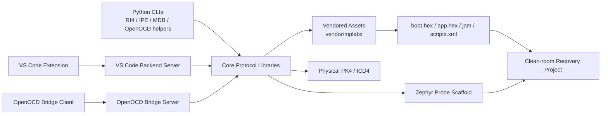
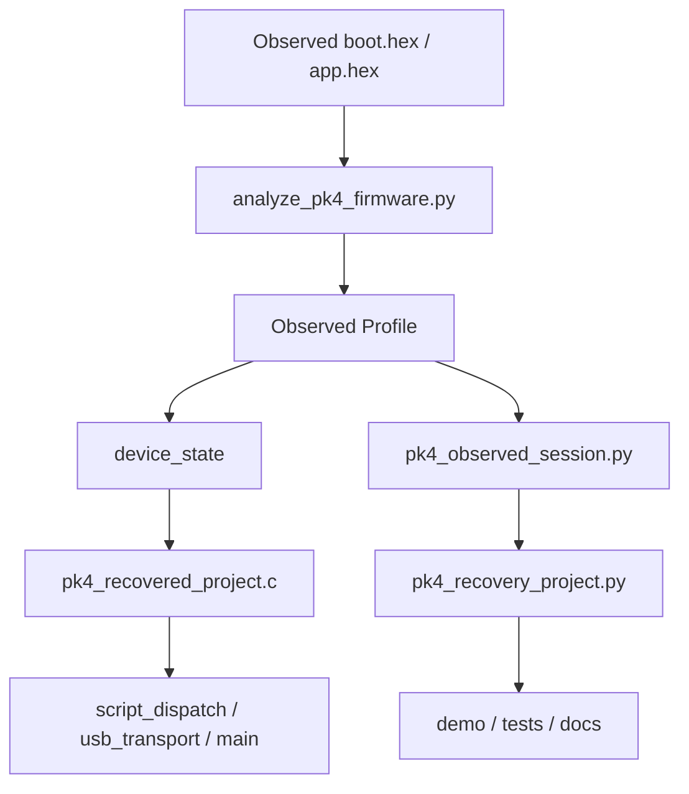

# System Architecture

This document summarizes the current repository architecture at a system level and explains how the host tooling, vendored assets, and Zephyr clean-room recovery work fit together.

## Scope

The repository is organized around three cooperating concerns:

- host-side protocol and tooling layers
- vendored runtime assets and firmware packages
- clean-room replacement and recovery scaffolding for a future RI4-compatible probe firmware

## Top-level Architecture

## Host-side Layers

### Core protocol packages

- `mchp_ri4`: RI4 side/data channel framing, script transport, pack asset lookup, power control, firmware update, and hardware session helpers.
- `mchp_ipecmd`: local socket protocol support for `ipecmd`-style integrations.
- `mchp_mdbcore`: a clean-room message mediator surface plus simulator-facing glue.
- `mchp_gdbrsp`: GDB remote serial protocol client helpers.

### Integration surfaces

- `mchp_vscode.backend_server`: JSON-line backend used by the VS Code extension.
- `mchp_openocd.bridge_server`: JSON-line TCP bridge for OpenOCD-facing integrations.
- `vscode_extension/`: repo-local VS Code extension scaffold.

## Asset and Firmware Layer

The repository can snapshot external MPLAB-managed assets into `vendor/mplabx/` so runtime flows do not depend on a live MPLAB installation.

Key categories include:

- toolpack XML and script packs
- MCU family packs and EDC metadata
- tool firmware update packages (`.jam`, `boot.hex`, `app.hex`)
- compressed XML/PIC runtime assets and compressed YAML inspection exports

## Zephyr Clean-room Layer

The Zephyr subproject is a compatibility and recovery scaffold rather than a firmware decompilation effort.

## Current Technical Boundaries

- The repository does not contain reconstructed proprietary vendor source code.
- The recovery model captures observed memory maps, reset vectors, slot roles, status behavior, and clean-room script surfaces.
- The current physical PK4 hardware blocker remains a timeout when writing RI4 traffic to endpoint `0x02`.

## Key Documents

- `README.md`: repo-level overview and operational entry points
- `mchp_ri4/docs/ri4_side_channel.md`: RI4 framing and message model
- `docs/vscode_backend_protocol.md`: VS Code backend command contract
- `docs/openocd_integration.md`: OpenOCD bridge contract and operational flow
- `zephyr_pickit4_replacement/README.md`: Zephyr scaffold overview
- `zephyr_pickit4_replacement/docs/pk4_firmware_migration.md`: PK4 observed-firmware migration rationale
- `zephyr_pickit4_replacement/docs/recovery_project.md`: clean-room recovery-project technical description