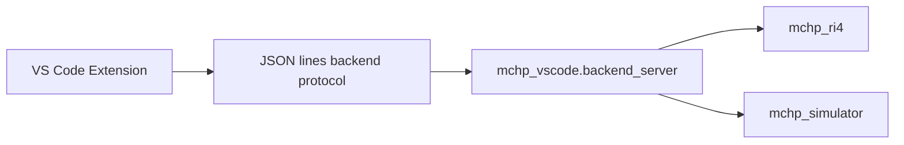

# VS Code Backend Protocol

The VS Code extension talks to `python -m mchp_vscode.backend_server` over newline-delimited JSON.

## Architecture Role

The backend protocol separates editor UX from protocol execution. The extension remains thin and delegates probe, simulator, and session behavior to the Python backend.



Request shape:

```json
{"id":1,"command":"ping","args":{}}
```

Response shape:

```json
{"id":1,"ok":true,"result":{"message":"pong"}}
```

Hardware family inventory:

- Command: `listHardwareFamilies`
- Purpose: return the generated RI4 family inventory used by the VS Code family browser and hardware-session helpers.

Supported filter arguments:

- `searchPrefix`: matches the start of `family`, `programmerClass`, or `debuggerClass`.
- `capability` or `capabilities`: require one or more raw-command capability tags.
- `signature` or `signatures`: require one or more raw-command signature names.
- `group` or `groups`: require one or more raw-command taxonomy groups.
- `capabilityMatch`, `signatureMatch`, `groupMatch`: each accepts `any` or `all`.

Examples:

```json
{"id":7,"command":"listHardwareFamilies","args":{"searchPrefix":"ProgrammerPIC32"}}
```

This narrows the inventory to families whose family name or owning Java programmer/debugger class starts with `ProgrammerPIC32`.

```json
{"id":8,"command":"listHardwareFamilies","args":{"searchPrefix":"PIC16","signatures":["vpp-operational-value"],"signatureMatch":"all"}}
```

This returns only families with a matching family/class prefix and the `vpp-operational-value` signature.

```json
{"id":9,"command":"listHardwareFamilies","args":{"groups":["power","trace"],"groupMatch":"all","capabilities":["target-reset-pulse"],"capabilityMatch":"all"}}
```

This returns only families that model both `power` and `trace` raw-command groups and also expose the `target-reset-pulse` capability.

Related commands:

- `probeTool`
- `hardwareStartSession`
- `hardwareSessionStatus`
- `hardwareEnterDebugMode`
- `hardwareGetPc`
- `hardwareSetPc`
- `hardwareRun`
- `hardwareStep`
- `hardwareHalt`
- `hardwareProgramHex`

## Current Guarantees

- Requests are independent unless a command explicitly acts on server-side session state.
- Responses always preserve the caller-provided `id` so the extension can correlate in-flight operations.
- Hardware-family inventory, capability filtering, and session semantics are derived from the repo's clean-room host model rather than from VS Code-specific logic.

## Current Limitations

- Real hardware execution is still constrained by the same RI4 and asset availability requirements documented elsewhere in the repo.
- The backend protocol describes the host-side controller contract only. It does not describe the clean-room Zephyr probe firmware transport, which is documented under `zephyr_pickit4_replacement/`.