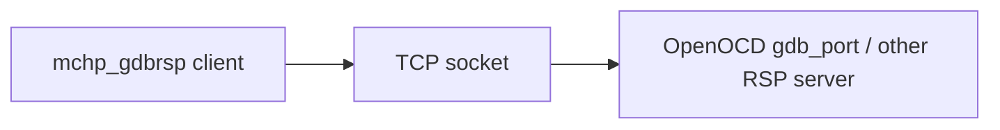

# GDB RSP client (clean-room)

`mchp_gdbrsp` is a minimal Python implementation of the **GDB Remote Serial Protocol** (RSP)
client side (i.e. what GNU `gdb` speaks when connecting to a remote target).

OpenOCD exposes an RSP server on its `gdb_port` (commonly `localhost:3333`).

## Architecture



## What’s implemented

- Packet framing `$...#cc`, checksum validation, escaping (`}` XOR 0x20)
- ACK/NAK mode, plus optional `QStartNoAckMode`
- Commands:
  - `qSupported`
  - memory read `mADDR,LEN`
  - memory write `MADDR,LEN:HEX...`
  - continue `c`, step `s` (stop reply parsing)
  - software breakpoints `Z0` / `z0`

  ## Design Boundary

  - This package is intentionally a client-side protocol helper, not a full debugger.
  - It is meant to compose with other repo integration layers such as the OpenOCD bridge and simulator-facing tooling.
  - Packet framing, checksum handling, and stop-reply parsing are the primary focus.

## Demo

```powershell
cd c:\GIT\open_microchip_tools
python -m mchp_gdbrsp.demo --host 127.0.0.1 --port 3333 --addr 0 --len 10
```
