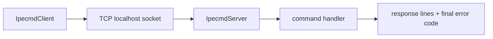

# IPECMD / IPECMDBoost socket protocol (clean-room)

This repo contains a small, runnable clean-room Python implementation of the **local socket protocol surface** used by MPLAB IPE’s `ipecmd` / `ipecmdboost` tooling.

## Architecture

## Wire format

- Transport: TCP socket (typically `localhost`)
- Request: **single UTF-8 line** terminated by `\n`
- Arguments: delimited by `#` (example: `ECHO#hello#world`)
- Response: **multiple UTF-8 lines**, terminated by a final error code line:

- Final line: `ERRORCODE:<int>`
- If the command succeeded (error code `0`), the server emits `Operation Succeeded` before `ERRORCODE:0`.

## Event/notification lines

Servers may emit asynchronous-looking progress or event lines prior to completion. This implementation uses the convention:

- `EVENT:<name>[...]`

Example: `PING` emits `EVENT:PONG`.

## Python API

- `mchp_ipecmd.server.IpecmdServer`: start/stop a socket server
- `mchp_ipecmd.client.IpecmdClient`: send one request and collect output lines + error code

## Operational Characteristics

- The protocol is line-oriented and intentionally simple to script.
- Progress and event lines are treated as ordinary response lines before final completion.
- The final `ERRORCODE:<int>` line is the authoritative completion record.

## Scope Boundary

This package models the localhost socket contract only. It does not attempt to reproduce the full IPE UI or the entire internal command set of the original tooling.

## Legacy import shims

These exist so legacy Java-like import paths can still resolve in Python:

- `com.microchip.mplab.ipecmdboost.Client`
- `com.microchip.mplab.ipecmd.IPECMD`
