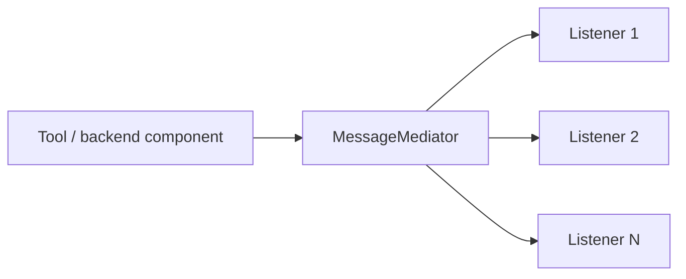

# MessageMediator (clean-room)

This is a small, Python-first reimplementation of the behavioral surface of:
`com.microchip.mplab.mdbcore.MessageMediator`.

## Role In The Repo

The mediator layer is the message-routing glue between MDBCore-style components and the simulator-facing surfaces in this repository.

## Semantics (mirrors Java)

- `MessageMediator.handleMessage(message, actionID)`
  - Returns `0` immediately if `message.isSuppressed()` is true.
  - Otherwise calls each registered listener in order.
  - Stops at the first listener that returns anything other than `-1`, and returns that value.
  - If no listener handles it, returns `-1`.

## Suppression

`Message.makeSuppressible(memo, providerKey, messageKey)` enables suppression lookups.

Two memo implementations exist:
- `NbPreferencesImpl`: in-memory key/value store (process lifetime).
- `PropertiesFileImpl`: minimal file-backed key/value store.

## Design Summary

- Dispatch order is deterministic and listener-ordered.
- The first non-`-1` listener result wins.
- Suppression is an explicit behavioral surface, not just a UI concern.
- The implementation is intentionally small and Python-first, but preserves the Java-visible contract closely enough for current repo integrations.

## Legacy shims

Imports like `from com.microchip.mplab.mdbcore.MessageMediator import MessageMediator` are supported via thin shims delegating to `mchp_mdbcore`.
