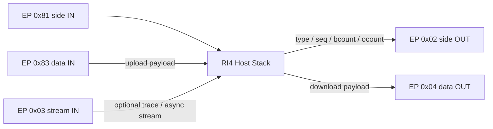

# RI4 side-channel framing (clean-room notes)

Tools like PICkit 4 / ICD 4/5 use two logical channels:

- **Side channel**: control/commands (bulk endpoints, smaller messages)
- **Data channel**: upload/download bulk transfers

This package implements the side-channel header format observed in the Java sources (`ICD4CommsUsb.createHeader`) and used throughout the clean-room RI4 tooling in this repository.

## Transport Topology

The repo currently models the following logical endpoint layout:

- `0x02`: side-channel OUT
- `0x81`: side-channel IN
- `0x04`: data-channel OUT
- `0x83`: data-channel IN
- `0x03`: optional stream IN

## Header

A message begins with a 16-byte little-endian header:

- `type` (u32): command/type identifier
- `seq` (u32): job/sequence number
- `bcount` (u32): total bytes in message (header + payload)
- `ocount` (u32): transfer length (bytes on data channel)

Payload follows immediately after the header.

## Message Types Used In This Repo

- `256` (`SCRIPT_NO_DATA`): run a named script without a data-channel transfer
- `0xC0000101` (`SCRIPT_WITH_DOWNLOAD`): acknowledge on the side channel, then consume download bytes on the data channel
- `0x80000102` (`SCRIPT_WITH_UPLOAD`): acknowledge on the side channel, then return upload bytes on the data channel
- `259` (`SCRDONE`): complete a scripted transfer and return final result status
- `261` (`COMMAND_GET_STATUS_FROM_KEY`): return a NUL-terminated status string for one key
- `13` (`RESULT_RESPONSE_TYPE`): side-channel result/ack envelope

## Clean-room Flow Model

The host implementation in `mchp_ri4.icd4_comms_usb` currently treats RI4 traffic as a two-stage exchange:

1. Send a side-channel header and script payload.
2. Receive an ACK or result on the side channel.
3. If `ocount != 0`, move transfer bytes on the data channel.
4. Send `SCRDONE` and receive the final status result.

For status queries, the host sends a side-channel packet containing a NUL-terminated UTF-8 key string and parses a NUL-terminated string response from offset 16 onward.

## Script Payload Shape

Script payloads used by the repo follow the Java-compatible `Script.addParams()` layout:

- `paramSizeBytes` (`u32le`)
- `scriptDataLength` (`u32le`)
- concatenated parameter blobs
- raw script bytes

Integer parameters are encoded as `u32le`. Strings are encoded as UTF-16LE. Byte blobs are passed through with a trailing NUL byte in the current clean-room implementation.

## Observed PK4 Compatibility Notes

- The current clean-room host stack matches the endpoint map observed on physical PICkit 4 hardware.
- The Zephyr scaffold and the observed PK4 fake probe both reuse this same framing.

## Hardware Bring-up Milestones

- Repo-local asset collection now supports vendoring the required PK4 toolpack and device-pack metadata so the RI4 host path can run without a live MPLAB install at runtime.
- The RI4 host stack now supports compressed YAML mirrors of vendored XML/PIC assets for inspection while keeping runtime compatibility with the original compressed XML/PIC layout.
- Physical PICkit 4 communication against a real dsPIC30F5011 now succeeds far enough to:
	- power the target from the tool,
	- enter and exit programming mode,
	- read program memory in repeatable multi-window transfers,
	- emit Intel HEX dumps from real hardware.
- The original failing `0x40` logical dump now succeeds with `--chunk-size 64` because the host planner trims logical tails from fixed physical windows rather than asking the tool for a short tail read.
- Larger real-hardware readback also succeeded for `0x100` bytes, confirming that the fixed-window rule applies beyond the first chunk.
- The remaining real-hardware blocker has moved from readback to full program/writeback reliability. The latest failures happen after successful dump/power work, during or around longer programming-side operations, and can still leave the PICkit 4 in a stale or disconnected USB state.

## Learned Lessons From dsPIC30F5011 + PICkit 4

- `SetSpeedFromDevice` must run before `EnterTMOD_HV` in the same session for dsPIC30F5011. Without that priming step, programming-mode entry can fail even when the same script set otherwise looks correct.
- Precleaning the scripting engine matters. Sending `AbortScriptingEngine` before sensitive sequences reduces stale-state failures and became necessary both for programming-mode entry and later for target-power recovery.
- A single USB read is not a reliable unit of RI4 upload completion. The data endpoint can fragment one logical upload across multiple USB packets, so the host must accumulate until the requested upload length is satisfied.
- The default short side-channel timeout is not sufficient for all real hardware operations. Power, erase, and programming flows need an explicit longer operation budget, and the same timeout budget must also cover the follow-up `SCRDONE` exchange.
- dsPIC30F program-memory reads on this PK4/device combination behave like fixed 60-byte physical windows.
- A 64-byte logical `ReadProgmem` request only returns 60 bytes on the data endpoint.
- A fresh short tail read can fail even when the address is valid. In testing, a 6-byte read at address `0x28` failed, while a 60-byte read at the same address succeeded.
- The practical host rule is: for dsPIC30F, request full 60-byte physical windows, then trim the extra bytes locally.
- dsPIC30F read planning also needs family geometry awareness. The host cannot advance addresses as if program memory were flat byte-addressed flash; it must account for the observed packed-memory width and address increment used by the family profile.
- Packet tracing on the normal dump/writeback CLI was critical. The useful evidence came from comparing real side/data endpoint traffic, not from exceptions alone.
- Once a long-running hardware operation fails, the PK4 can be left in a bad state. Follow-on symptoms included side-channel timeouts, pipe errors, and eventual disappearance from USB enumeration, which means recovery and retry logic are part of normal bring-up rather than optional polish.

## Current Practical State

- Readback is no longer the primary blocker for dsPIC30F5011 on PK4 in this repo.
- The clean-room RI4 path has validated real target power, programming-mode entry, and multi-window program-memory dumping on physical hardware.
- End-to-end erase/program/verify is not yet reliable enough to call complete. The remaining work is concentrated in the programming-side flow and probe recovery behavior after failures.
