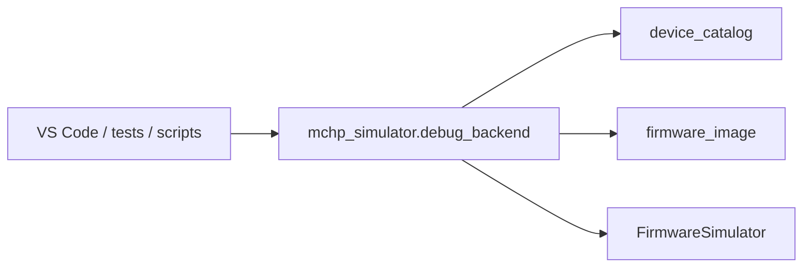

# Simulator Debug Backend

This document describes the clean-room simulator debug backend used by the VS Code integration and repo-local simulator workflows.

## Architecture

## Responsibilities

- initialize a simulator session for a named device
- load firmware images into the simulator
- expose debug-style controls such as reset, halt, step, run, breakpoint management, PC changes, and memory reads
- return a structured status snapshot suitable for UI and test consumers

## Backend Surface

Key operations include:

- `list_devices()`
- `init_session()`
- `load_firmware()`
- `reset()`
- `halt()`
- `step()`
- `run()` / `run_steps()`
- `add_breakpoint()` / `clear_breakpoints()` / `list_breakpoints()`
- `set_pc()`
- `read_program()` / `read_memory()`
- `get_status()`

## Status Contract

The backend currently reports:

- selected device information
- current PC when available
- simulated instruction throughput
- execution trace samples
- active breakpoints
- whether firmware is currently loaded

## Scope Boundary

The simulator backend is a repo-local debug/testing aid. It is not a full hardware replacement and it does not model all family-specific peripheral behavior.