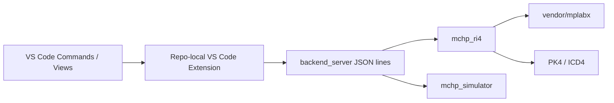

# Open Microchip Tools VS Code Extension

This extension is intentionally repo-local.

## Position In The Repo

The extension is the editor-facing integration surface for the repo's clean-room host stack. It does not implement protocol logic itself. Instead, it delegates hardware and simulator operations to the Python backend and consumes the same RI4 family model, status behavior, and session semantics documented elsewhere in the repository.

The extension also contributes an `Open Microchip Tools` Activity Bar container so the common hardware, simulator, and demo flows are available from a dedicated sidebar instead of only through the command palette.

The sidebar is organized into Hardware, Hardware Control, Simulator, and Tools views. Hardware and Simulator now surface live session summaries when a backend session is active, and each view exposes a refresh action in the title area. The Tools view also exposes the backend output channel directly.



What it supports today:

- Probe PICkit 4 or ICD4 over the clean-room RI4 USB layer using user-supplied VID/PID values.
- Start a hardware script session using repo-local `scripts.xml` and optional `tool.xml` inputs.
- Enter debug mode, read/set PC, run, step, halt, and program a HEX image over that hardware script session.
- Start a firmware simulator session using the in-repo simulator backend.
- Step, run, halt, inspect status, and add breakpoints in that simulator session.

What it does not support yet:

- Bundled PK4/ICD4 script packs inside this repository. You must point the extension at compatible `scripts.xml` content already available in the workspace.
- Device-family-specific polish beyond the common RI4 script names (`EnterDebugMode`, `GetPC`, `SetPC`, `Run`, `SingleStep`, `Halt`, `EraseChip`, `WriteProgmem`, `ReadProgmem`).

This means the extension is repo-native at the transport/controller layer, but it still depends on script XML assets to drive a specific target family.

## Backend Contract

The extension communicates with `python -m mchp_vscode.backend_server` using newline-delimited JSON.

- Protocol reference: `docs/vscode_backend_protocol.md`
- Hardware family inventory source: `mchp_ri4.family_profiles`
- Clean-room probe/recovery reference: `zephyr_pickit4_replacement/`

## Operational Constraints

- Real hardware sessions still depend on compatible `scripts.xml` content for the target family unless the flow is one of the script-independent RI4 commands such as tool power control.
- The repo currently vendors pack and firmware assets, but full physical PICkit 4 session parity is still limited by the unresolved endpoint `0x02` timeout on the physical device.
- The extension can still exercise the repo-local simulator and clean-room session paths without that hardware dependency.

## Build

Build from the extension folder:

```powershell
cd vscode_extension
npm install
npm run compile
```

This writes the compiled extension entrypoint to `vscode_extension/out/extension.js`.

If you are iterating on the extension, use watch mode instead:

```powershell
cd vscode_extension
npm install
npm run watch
```

## Package

Create an installable `.vsix` from the same folder:

```powershell
cd vscode_extension
npm install
npm run package
```

The packaged artifact is written next to `package.json`. With the current manifest version, the output file is:

- `vscode_extension/open-microchip-tools-0.0.1.vsix`

The package command runs a compile first through `vscode:prepublish`, so it is safe to use on a clean checkout.

## Install In VS Code

From VS Code:

1. Open the command palette.
2. Run `Extensions: Install from VSIX...`.
3. Select `vscode_extension/open-microchip-tools-0.0.1.vsix`.

From a shell with the `code` CLI available:

```powershell
code --install-extension vscode_extension/open-microchip-tools-0.0.1.vsix
```

## Development Notes

- The extension expects the repository layout to stay intact because it launches repo-local Python backends and consumes repo-local assets.
- Packaging is intended for local installation and testing, not for Marketplace publication.
- If you change the extension version in `package.json`, the `.vsix` filename changes to match.

## Verified Commands

The following commands were verified in this repository on Windows:

```powershell
cd vscode_extension
npm run compile
npx @vscode/vsce package
```
