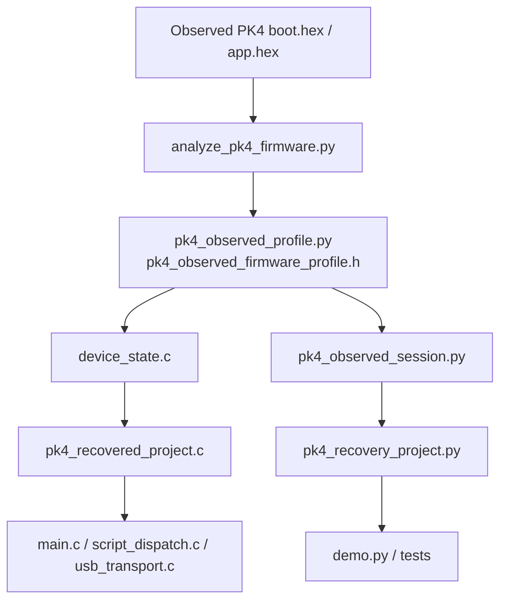

# Zephyr RI4 Probe Scaffold

This subproject is a clean-room Zephyr application scaffold aimed at replacing the USB-facing portion of a PICkit 4 style probe for the protocol surfaces modeled in this repository.

It is intentionally scoped as an MVP scaffold, not a verified drop-in PICkit 4 firmware image.

## Clean-room Scope

This subproject does **not** attempt to reconstruct or translate proprietary vendor firmware into source code. Instead, it packages observed firmware facts into a compatible clean-room project structure that can be implemented incrementally.

The current recovery-oriented project model treats the observed PK4 firmware package as three named compatibility slots:

- `boot`: minimal boot strap region at `0x00400000`
- `app`: primary RI4-facing application slot at `0x0040C000`
- `app2`: secondary CMSIS-DAP / control-update slot at `0x00500000`

## Architecture



## What This Project Does

- Reserves the RI4 USB endpoint layout expected by this repo's Python transport layer.
- Implements the RI4 side-channel framing described in `mchp_ri4.icd4_comms_usb` and `mchp_ri4.docs.ri4_side_channel`.
- Builds a compile-time family/script catalog from the existing Python family model instead of duplicating those tables by hand.
- Provides a stub script executor and device-state model that can be replaced incrementally with real per-family programming and debug logic.

## What It Does Not Do Yet

- Execute MPLAB RI4 script bytecode.
- Drive real PIC target pins for VPP, VDD, PGC, PGD, JTAG, or SWD.
- Emulate every PICkit 4 side feature such as power control, trace streaming, or proprietary status behavior.

## Concrete Bring-Up Paths

- `boards/nrf52840dk_nrf52840.conf` enables a Zephyr USB-device board profile for a real MCU target.
- `tools/gen_stub_scripts_xml.py` generates a clean-room `scripts.xml` for a modeled family using tiny custom opcodes instead of MPLAB bytecode.
- `tools/analyze_pk4_firmware.py` extracts a clean-room report from the vendored PK4 `boot.hex` / `app.hex` images for migration planning.
- `tools/exercise_pk4_status.py` exercises the observed PK4 profile and RI4 status keys from the host side without requiring a Zephyr build.
- `pk4_observed_session.py` exposes a fake RI4 probe/session wired to the observed PK4 slot model so host-side tests can drive real RI4 framing and explicit primary-slot vs secondary-slot programming helpers.
- `pk4_recovery_project.py` packages the observed boot/app/app2 layout into a clean-room recovery project manifest and slot-level exercise path. This is a behavioral reconstruction project, not restored proprietary source.
- The observed-session path now has dedicated script names and opcodes for `WritePrimarySlot`, `ReadPrimarySlot`, `WriteSecondarySlot`, and `ReadSecondarySlot`, so update-style flows do not need to smuggle slot intent through absolute addresses.
- `docs/pic18_stub_probe.md` now covers the current modeled stub families: `PIC18`, `PIC16Enhanced`, `ARM_MPU`, `PIC32MZ`, `DSPIC30F`, `DSPIC33FJ`, `DSPIC33EP`, `DSPIC33A`, and `AVR`.
- `docs/zephyr_usb_target.md` documents the current USB target assumption: the legacy Zephyr USB device API on `nrf52840dk_nrf52840`, with graceful no-USB fallback on `native_sim`.
- `docs/pk4_firmware_migration.md` records the observed PK4 boot/app/app2 facts and how they should steer the Zephyr migration.
- `docs/zephyr_module_architecture.md` describes the internal module boundaries of the clean-room scaffold.
- `docs/recovery_project.md` and `docs/pk4_recovery_project.json` describe the recovered clean-room project layer in prose and machine-readable form.
- `docs/traceability_matrix.md` links observed firmware facts to the clean-room modules that currently encode them.
- `docs/pk4_combined_manifest.json` combines the key observed-profile and recovery-project facts in one machine-readable artifact.
- `demo.py` provides a repo-local host demo for the current stub-family path and can be launched from the VS Code extension.

## Host Assumptions Carried From This Repo

The host-side Python stack currently assumes these logical endpoints:

- `0x02` side-channel OUT
- `0x81` side-channel IN
- `0x04` data-channel OUT
- `0x83` data-channel IN
- `0x03` optional streaming IN

The RI4 side channel uses a 16-byte little-endian header:

- `type`
- `seq`
- `bcount`
- `ocount`

## Build Notes

Typical Zephyr build invocation:

```powershell
west build -b native_sim zephyr_pickit4_replacement
```

For a real MCU target, replace `native_sim` with a board that supports Zephyr USB device mode and enough RAM for the chosen buffers.

The build runs `tools/gen_ri4_catalog.py` to generate `ri4_family_catalog.h` from the repo's Python family model.

Host-side observed-profile exercise:

```powershell
python -m zephyr_pickit4_replacement.tools.exercise_pk4_status
```

Observed PK4 RI4 session demo:

```powershell
python -m zephyr_pickit4_replacement.demo --mode pk4-observed
```

Clean-room recovery-project exercise:

```powershell
python -c "from zephyr_pickit4_replacement.pk4_recovery_project import exercise_pk4_recovery_project; import json; print(json.dumps(exercise_pk4_recovery_project(), indent=2, sort_keys=True))"
```

The current observed PK4 profile exposed by the scaffold models:

- boot slot at `0x00400000`
- primary app slot at `0x0040C000`
- secondary app/control slot at `0x00500000`
- primary slot role: `RI4 host-facing app slot`
- secondary slot identity: `MPLAB PICkit 4 CMSIS-DAP`

The host-side profile and the Zephyr-side `device_state` now also expose slot-aware status keys so the scaffold can distinguish where execution is modeled and whether the most recent program-space access touched boot, the primary RI4 slot, or the secondary CMSIS-DAP/update slot.

## Recovery Project Layer

The newest clean-room abstraction in this subproject is the recovered-project layer:

- `src/pk4_recovered_project.c` and `src/pk4_recovered_project.h` provide a Zephyr-side source representation of the recovered boot/app/app2 project.
- `pk4_recovery_project.py` mirrors the same structure on the host side and can exercise the current observed-session model.
- The goal is to give the repo a stable source-level project description even though the original proprietary source is unavailable.

## Technical Boundaries

- The current implementation models slot identities, vectors, window sizes, and status behavior.
- The current implementation does not model vendor cryptography, proprietary script bytecode semantics, or the full PK4 application logic.
- The current implementation uses dedicated clean-room slot scripts for primary and secondary slot access instead of assuming every update flow is a generic absolute-address write.

## Suggested Next Steps

1. Replace the stub `script_dispatch_execute()` implementation with a real RI4 script VM or a constrained per-family command interpreter.
2. Move the real hardware target from the current `nrf52840dk_nrf52840` transport prototype toward a Cortex-M board whose memory model is closer to the observed PK4 boot/app images.
3. Expand the Zephyr USB transport backend for the chosen board if the local Zephyr version needs different USB APIs.
4. Replace more stub-family aliases with family-specific semantics once the first real target-pin backend exists.