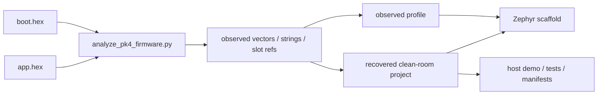

# PK4 Firmware Migration Notes

This note records the clean-room reverse-engineering facts we can recover from the vendored PK4 `boot.hex` and `app.hex` images and how those facts should influence the Zephyr replacement project.

## Current Clean-room Output

The observed firmware facts now drive three concrete source-level artifacts in this repo:

- a Zephyr-side observed profile (`device_state`, `pk4_observed_firmware_profile.h`)
- a slot-aware observed RI4 session model (`pk4_observed_session.py`)
- a clean-room recovered project description (`pk4_recovery_project.py` and `src/pk4_recovered_project.c`)



## Observed Facts

- The boot image starts at `0x00400000`.
- The app image starts at `0x0040C000`.
- The PK4 JAM manifest also declares `app2` at `0x00500000`, and the app HEX contains a real second segment starting at that address.
- The first boot vector words are:
  - initial SP: `0x2040DC08`
  - reset vector: `0x004001AD`
- The first app vector words are:
  - initial SP: `0x20449460`
  - reset vector: `0x0040E8AD`
- The second app-like segment at `0x00500000` also starts with a valid Cortex-M vector table:
  - initial SP: `0x2040A910`
  - reset vector: `0x00504189`
- Both reset vectors are odd addresses, which is a strong Cortex-M Thumb entry signal.
- Both initial stack pointers point into a `0x2040_0000` SRAM region.
- Application strings include `Microchip Technology Incorporated`, `WINUSB`, and `PICkit 4`.
- `boot.hex` ends with a 12-byte trailer at `0x0040BFF4` whose embedded version word is `0x00010000`, matching the JAM boot version `010000`.
- `app.hex` ends with a 12-byte trailer at `0x005FFFF4` whose embedded version word is `0x00020515`, matching the JAM `app1` version `020515`.
- Direct 32-bit word scans show `boot.hex` referencing `0x0040C000` multiple times, but no observed direct references to `0x00500000`.
- `app.hex` references both `0x0040C000` and `0x00500000`, and each slot's reset vector appears at the expected vector-table entry inside its own segment.
- Inside `app.hex`, the primary segment at `0x0040C000` contains the observed cross-slot reference to `0x00500000`, while the secondary segment self-references but does not show an observed direct reference back to `0x0040C000`.
- `WINUSB` appears in the primary app segment but not the secondary segment, while `CMSIS` is visible in the secondary segment.
- The secondary segment also contains the banner `MPLAB PICkit 4 CMSIS-DAP` at `0x00523C68` and aligned references to `0xE000ED00` at `0x005041F4`, `0x0051EA04`, and `0x005228BC`.
- The aligned primary cross-slot reference at `0x00456864` sits inside a pointer-rich 32-bit window, which is more consistent with a descriptor or dispatch table than with inline instruction bytes.

## Inference

The observed vector tables and SRAM window strongly suggest that the PK4 firmware runs on an ARM Cortex-M MCU in a SAM E70-class memory map, not on the `nrf52840dk_nrf52840` board currently used for the first Zephyr USB scaffold.

The extra segment at `0x00500000` means the package is not just a single boot image plus a single application image. The current best interpretation is that the tool firmware package carries a primary application slot and a second application-class slot used for upgrade, recovery, or staged deployment. The fact that boot references the primary app base but not the secondary slot, and that the primary app references the secondary slot while the secondary slot mostly self-references, suggests the second slot is likely managed by the primary application or by update logic layered above the minimal boot path. The `CMSIS-DAP` banner and `0xE000ED00` references further suggest the secondary image contains low-level Cortex-M control code rather than only host-facing USB string/data surfaces, and the primary app's aligned `0x00500000` reference appears to live in a descriptor-like table rather than an obvious straight-line code sequence.

That means a realistic migration strategy is:

1. Preserve the RI4 USB framing and host-visible endpoint behavior in Zephyr.
2. Preserve the observed boot/app split and startup assumptions as compatibility targets.
3. Reimplement the required behavior clean-room in Zephyr rather than trying to translate proprietary machine code.

## Practical Zephyr Impact

- The current `nrf52840dk_nrf52840` path remains useful as a transport prototype.
- A more faithful future hardware target should be a Cortex-M board with USB device support and memory characteristics closer to the observed PK4 firmware.
- The Zephyr scaffold should treat the PK4 images as behavioral references for:
  - reset/startup model
  - boot/app split
  - USB-facing RI4 behavior
  - host-visible status strings and compatibility expectations
- The current `device_state` implementation now models separate bounded boot, primary-app, and secondary-app apertures rooted at the observed bases (`0x00400000`, `0x0040C000`, and `0x00500000`) instead of a zero-based 4 KB buffer.
- RI4 status queries can now report observed-profile values such as `Probe Profile`, `Boot Base`, `App Base`, `App2 Base`, `Reset Vector`, `App2 Reset Vector`, `Initial SP`, `App2 Initial SP`, the boot/app/app2 window sizes, and the secondary slot role and identity.
- The scaffold now also distinguishes slot semantics in status-space by reporting the primary role, the current execution slot/role derived from the modeled PC, and the most recent program-space region/role touched by reads or writes.
- The scaffold now also contains a named recovered-project layer with explicit `boot`, `app`, and `app2` slot descriptors so clean-room source modules can target recovered compatibility surfaces directly.

## Recovery-project Interpretation

The repo now treats the observed firmware package as a project with three responsibilities:

- `boot`: minimal startup and handoff surface
- `app`: primary RI4-facing slot expected to own host-visible probe behavior
- `app2`: secondary CMSIS-DAP / control-update slot expected to hold update, recovery, or control-oriented behavior

This interpretation is intentionally conservative. It captures the structure that is strongly supported by the observed images without claiming that the repo has reconstructed the missing proprietary code.

## Repo Artifacts

- Observed constants are summarized in `src/pk4_observed_firmware_profile.h`.
- A checked-in machine-readable baseline is stored at `docs/pk4_firmware_observed.json`.
- A host-side exerciser for the same observed profile is available at `tools/exercise_pk4_status.py`.
- A clean-room project manifest and exercise path are available in `pk4_recovery_project.py` and `src/pk4_recovered_project.c`.
- A machine-readable report can be regenerated with:

```powershell
python -m zephyr_pickit4_replacement.tools.analyze_pk4_firmware --boot-hex vendor\mplabx\tool_firmware\pk4\boot.hex --app-hex vendor\mplabx\tool_firmware\pk4\app.hex --jam vendor\mplabx\tool_firmware\pk4\PK4FW_001000.jam
```