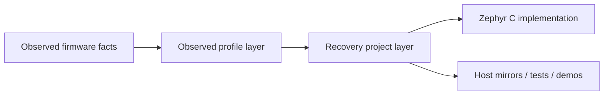

# Recovery Project

This document describes the clean-room recovery-project layer derived from the observed PK4 `boot.hex` and `app.hex` images.

## Purpose

The recovery-project layer gives the repository a source-level project description for the observed PK4 firmware package without claiming to recover the original proprietary source code.

It packages the observed slot layout into named source artifacts that can be implemented, tested, and documented consistently.

## Slot Model

The current clean-room model represents three slots:

| Slot | Base | Role | Identity |
| --- | ---: | --- | --- |
| `boot` | `0x00400000` | boot strap slot | PK4 observed boot image |
| `app` | `0x0040C000` | RI4 host-facing app slot | PK4 observed primary RI4 app |
| `app2` | `0x00500000` | CMSIS-DAP control/update slot | MPLAB PICkit 4 CMSIS-DAP |

## Source Artifacts

- `src/pk4_recovered_project.h`: Zephyr-side project and slot descriptors
- `src/pk4_recovered_project.c`: Zephyr-side initialization and slot access helpers
- `pk4_recovery_project.py`: host-side mirror of the same project model
- `pk4_observed_session.py`: clean-room RI4 session model used to exercise slot behavior
- `docs/pk4_recovery_project.json`: checked-in machine-readable project manifest for downstream tooling and documentation

## Relationship To Other Layers



The observed profile defines the raw compatibility facts. The recovery-project layer packages those facts into a reusable source-level description.

## Technical Responsibilities

The recovery-project layer currently owns:

- naming the recovered slots and their roles
- exposing a stable project manifest on the host side
- exposing slot descriptors to the Zephyr C layer
- routing explicit primary-slot and secondary-slot accesses through clean-room helpers

The recovery-project layer does not currently own:

- vendor cryptography or secure boot behavior
- complete emulation of proprietary application logic
- direct target-pin electrical behavior

## Operational Paths

Host-side exercise:

```powershell
python -c "from zephyr_pickit4_replacement.pk4_recovery_project import exercise_pk4_recovery_project; import json; print(json.dumps(exercise_pk4_recovery_project(), indent=2, sort_keys=True))"
```

The expected result is a manifest plus primary-slot and secondary-slot read/write roundtrips using the clean-room slot-specific scripts.

Static machine-readable manifest:

```powershell
type zephyr_pickit4_replacement\docs\pk4_recovery_project.json
```

## Design Intent

This layer exists to keep the reverse-engineering output actionable. Instead of leaving the repo with only notes about vectors, slot references, and strings, it turns those observations into maintainable source-level contracts that the rest of the project can build against.