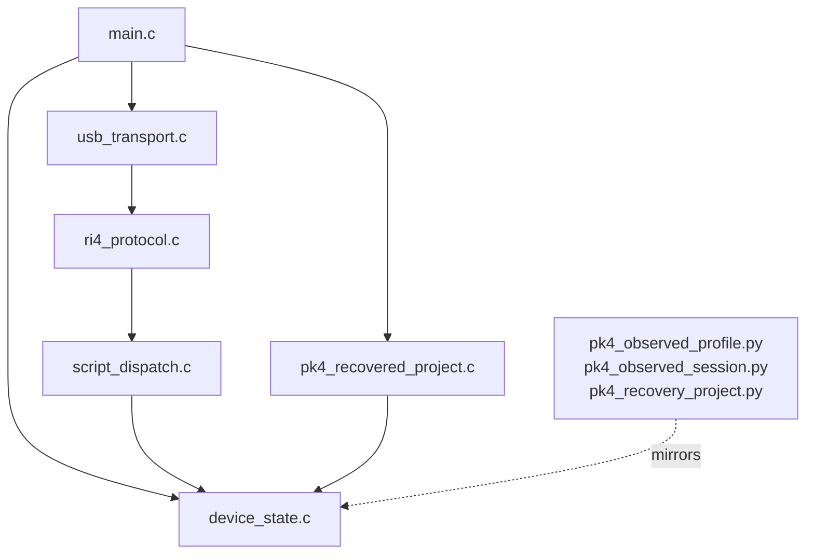

# Zephyr Module Architecture

This document describes the internal module structure of the Zephyr clean-room probe scaffold.

## Module Map

## Module Responsibilities

### `main.c`

- initializes the device-state model
- initializes the recovered-project layer
- logs the current observed-profile and recovered-project summaries
- starts the USB transport when available on the chosen board

### `device_state.c`

- owns the modeled boot, primary-app, and secondary-app windows
- tracks execution state such as PC, halted/debug status, and last accessed program region
- exposes slot-aware helpers for primary-slot and secondary-slot access

### `pk4_recovered_project.c`

- packages the current observed PK4 layout into a stable project/slot description
- maps recovered slots to the underlying device-state helpers
- provides a source-level abstraction that is higher-level than raw address windows

### `ri4_protocol.c`

- parses the RI4 side-channel header
- routes supported message types into the script dispatcher or status lookup
- encodes ACK/result packets and status-string responses

### `script_dispatch.c`

- implements the clean-room stub opcode model
- supports generic `WriteProgmem` and `ReadProgmem` flows
- supports explicit `WritePrimarySlot`, `ReadPrimarySlot`, `WriteSecondarySlot`, and `ReadSecondarySlot` flows

### `usb_transport.c`

- binds the current model to a Zephyr USB device transport
- is the board/API adaptation boundary for future Zephyr USB changes

## Design Principles

- Keep the protocol surface independent from the selected Zephyr board where practical.
- Prefer explicit slot-aware behaviors over implicit absolute-address conventions.
- Keep the host-side mirror modules aligned with the C-side state and recovery layers.

## Current Gaps

- The dispatcher still implements a stub opcode model rather than a full RI4 script VM.
- The transport layer is still tied to legacy Zephyr USB API assumptions.
- The model captures observed slot structure and status semantics, but not the full proprietary firmware logic.