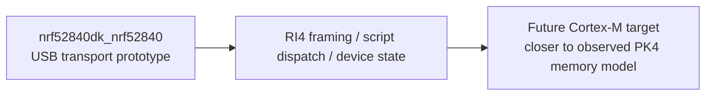

# Zephyr USB Target

The current USB transport scaffold targets the legacy Zephyr USB device API exposed by `usb_enable()` and endpoint callbacks.

## Why This Target Still Exists

The current USB target choice is a bring-up convenience, not a claim that the original PK4 hardware is based on the same MCU family. The observed PK4 boot/app images look much closer to a SAM E70-class Cortex-M memory map, but the current repo still benefits from a widely supported Zephyr board for protocol bring-up.



Concrete target assumptions:

- Zephyr 3.7 LTS style USB device stack
- board: `nrf52840dk_nrf52840`
- protocol-only fallback board: `native_sim`

Observed PK4 firmware migration note:

- The vendored PK4 `boot.hex` / `app.hex` images look like Cortex-M firmware with stack pointers in the `0x2040_0000` SRAM range.
- That makes the current nRF52 board a useful USB transport prototype, but probably not the closest long-term hardware match for a faithful PK4 replacement.
- See `docs/pk4_firmware_migration.md` for the clean-room reverse-engineered facts and migration implications.

## Real Board Bring-Up

```powershell
west build -b nrf52840dk_nrf52840 zephyr_pickit4_replacement
```

This board profile keeps USB enabled and is the intended first hardware target for the current transport implementation.

## Protocol-Only Bring-Up

```powershell
west build -b native_sim zephyr_pickit4_replacement
```

`native_sim` disables the USB device stack through `boards/native_sim.conf`. The firmware will log a warning and continue running the protocol/state scaffold without attempting USB initialization.

## Notes

- If your local Zephyr version has moved away from the legacy USB API, `src/usb_transport.c` is the only file that should need significant adaptation.
- The rest of the RI4 framing, family catalog generation, and stub-script path are intentionally decoupled from the USB stack choice.
- The recovered-project and observed-profile layers are intentionally above the board-choice boundary, so the same clean-room slot model can move to a better future board without rewriting the host-side documentation or tests.