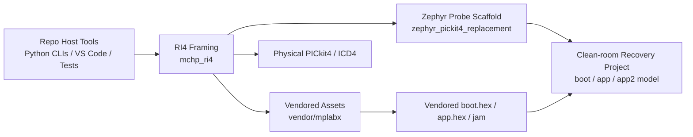

# open_microchip_tools

> OpenOCD import note: this copy is a source-only helper/tooling import. The
> generated feature base's `vendor/` assets, built VS Code package, and older
> `openocd/overlay/` integration are intentionally excluded. See
> `OPENOCD_IMPORT.md`.

This workspace contains a clean-room Python reimplementation of selected behavioral and protocol surfaces needed to work with Microchip tooling without depending on a live MPLAB installation at runtime.

The repository now spans three related layers:

- repo-local host tooling for RI4, IPE socket, MDBCore, simulator, and OpenOCD integration
- vendored assets and firmware packages needed for independent operation
- a clean-room Zephyr replacement scaffold for the USB-facing portion of a PICkit 4 style probe

## Architecture Overview



## Current Technical Position

- The repo can vendor MPLAB assets, tool firmware, and MCU packs into `vendor/mplabx/` for repo-local operation.
- The RI4 host stack models the observed side/data channel framing, status queries, and named script transfer flow.
- The Zephyr subproject does not contain restored vendor source code. It contains a clean-room compatibility scaffold and a recovery-project model derived from observed firmware facts.
- Real hardware interaction with a physical PICkit 4 is no longer blocked at initial side-channel bring-up. The repo has now validated target power, programming-mode entry, and dsPIC30F5011 program-memory dumping on physical hardware.
- The current unresolved physical-hardware work is the full erase/program/verify path and robust recovery after failed long-running programming operations, which can still leave the PICkit 4 in a stale or disconnected USB state.
- The OpenOCD bridge now has a Renode GDB backend for the custom PIC16, PIC18, dsPIC30, and dsPIC33 cores. It allows deterministic no-hardware validation of erase/program/verify, memory access, run/halt/step, PC access, breakpoints, and watchpoints. The supplied dsPIC30 target is the `dsPIC30F5011` platform from the custom Renode branch.

## Implemented (iteration 1)

- `mchp_ipecmd`: minimal client/server for the `ipecmd` / `ipecmdboost` **localhost socket line protocol**
- Legacy shims:
	- `com.microchip.mplab.ipecmd.IPECMD`
	- `com.microchip.mplab.ipecmdboost.Client`

## Implemented (iteration 2)

- `mchp_mdbcore`: minimal reimplementation of `com.microchip.mplab.mdbcore.MessageMediator`
- `mchp_simulator`: minimal simulator package (`Simulator`) + lazy stubs for the huge `com.microchip.mplab.mdbcore.simulator.*` tree
- `mchp_mdbcore.simulator`: compatibility re-export of the minimal `Simulator`
- Legacy shim:
	- `com.microchip.mplab.mdbcore.MessageMediator`
	- `com.microchip.mplab.mdbcore.simulator.Simulator`
- Docs: `mchp_mdbcore/docs/message_mediator.md`

## Implemented (iteration 3)

- `mchp_gdbrsp`: thread-aware **GDB RSP client** used for OpenOCD and Renode endpoints
- `mchp_renode_cosim.gdb_session`: OpenOCD-compatible Renode backend for PIC16/PIC18/dsPIC30/dsPIC33 custom cores
- Docs: `mchp_gdbrsp/docs/gdb_rsp.md`

## Implemented (iteration 4)

- `mchp_ri4`: minimal RI4 USB comm framing (side/data channels) + script transfer helpers (`Script`, `Commands`, `DeviceFileSAXReader`)
- Docs: `mchp_ri4/docs/ri4_side_channel.md`

## Run the demo

```powershell
cd c:\GIT\open_microchip_tools
python -m mchp_ipecmd.demo PING
```

## VS Code Extension

There is now a repo-local VS Code extension scaffold in `vscode_extension/`.

It currently exposes:

- PICkit 4 and ICD4 RI4 probe commands using this repo's Python USB/RI4 code.
- Hardware script-session commands that can use repo-local `scripts.xml` and `tool.xml` inputs to enter debug mode, inspect/set PC, run, step, halt, erase, and program firmware.
- A simulator debugging command set backed by `mchp_simulator.debug_backend`.

The repo still does not include the default PK4/ICD4 tool-pack XML/JAR assets referenced by the bundled Java sources, so full out-of-the-box hardware support is still blocked on those script resources being present in the workspace.

For tool-supplied target power before a hardware session, the repo now also includes a direct RI4 power CLI that does not require `scripts.xml`:

```powershell
cd c:\GIT\open_microchip_tools
python -m mchp_ri4.power_cli --tool pk4 --voltage 5.0
```

If more than one Microchip USB tool is connected, re-run with `--pid 0x....`.

For a full hardware memory dump to Intel HEX and optional write-back, the repo now also includes:

```powershell
cd c:\GIT\open_microchip_tools
python -m mchp_ri4.hardware_roundtrip_cli --tool pk4 --pid 0x9012 --family DSPIC30F --processor DSPIC30F5011 --scripts path\to\scripts.xml --start-address 0x0 --length 0x100 --output dump.hex --power-voltage 5.0
```

To make the hardware flow independent from a live MPLAB installation, first vendor the required toolpack and device-pack assets into the repository:

```powershell
python -m mchp_ri4.asset_collector --tool pk4 --processor dsPIC30F5011
```

That snapshots the current MPLAB pack files into `vendor/mplabx/` and writes `vendor/mplabx/asset_manifest.json`. After that, the roundtrip command can omit `--scripts` and use the vendored `scripts.xml` automatically.

To vendor every MCU family pack advertised as supported by the installed PICkit 4 and ICD4 toolpacks, run:

```powershell
python -m mchp_ri4.asset_collector --all-supported --tools pk4 icd4
```

That snapshots the PK4 and ICD4 toolpacks plus each matching DFP pack's `edc/` metadata into `vendor/mplabx/` and records the supported processor inventory in `vendor/mplabx/asset_manifest.json`.

To inspect the storage shape of the vendored XML/PIC metadata, export a YAML view for human browsing, or create a colder `tar.xz` archive without changing the runtime files, run:

```powershell
python -m mchp_ri4.asset_storage report
python -m mchp_ri4.asset_storage export-yaml --output-root vendor\mplabx_yaml
python -m mchp_ri4.asset_storage export-yaml --gzip --output-root vendor\mplabx_yaml_gz
python -m mchp_ri4.asset_storage view-yaml vendor\mplabx_yaml_gz\packs\Microchip\dsPIC30F_DFP\1.5.254\edc\DSPIC30F5011.yaml.gz --start-line 1 --end-line 30
python -m mchp_ri4.asset_storage archive-xz --output vendor\mplabx.tar.xz
```

The repo continues to use compressed XML (`*.xml.gz`, `*.PIC.gz`) for runtime compatibility; the YAML export is inspection-only. Use `--gzip` when exporting the full tree to avoid exhausting disk space on very large script bundles.

Recent real-hardware dsPIC30F5011 lessons are summarized in `mchp_ri4/docs/ri4_side_channel.md`, including the required `SetSpeedFromDevice` priming step, fixed 60-byte physical read windows, fragmented data-endpoint uploads, and the current writeback-stage blocker.

The collector now also snapshots the tool firmware update payloads from each supported toolpack, including the default PK4 and ICD4 `.jam` files used by MPLAB for internal tool firmware updates and recovery, plus the companion `app.hex` and `boot.hex` images needed to apply those updates without reading back from the installed MPLAB toolpack.

To inspect the vendored firmware packages or compare a connected tool's reported firmware version to the vendored default, run:

```powershell
python -m mchp_ri4.firmware_update inventory
python -m mchp_ri4.firmware_update probe --tool pk4 --pid 0x9012
```

To attempt a repo-local PK4 application firmware update using the vendored `.jam` metadata plus vendored `app.hex` and `boot.hex`, run:

```powershell
python -m mchp_ri4.firmware_update apply --tool pk4 --pid 0x9012
```

To attempt a repo-local PK4 bootloader recovery write using the vendored `boot.hex`, run:

```powershell
python -m mchp_ri4.firmware_update apply --tool pk4 --pid 0x9012 --mode boot
```

If the tool stops responding, reports a mismatched on-disk firmware version, or needs emergency recovery, the probe command returns the vendored recovery image path and a recommendation to use that package on the next firmware-recovery connection.

## OpenOCD Bridge

- `mchp_openocd.bridge_server` exposes one target-facing JSON contract with two backends: physical RI4 (`--backend ri4`) and Renode GDB (`--backend renode`).
- The maintained OpenOCD integration is in `openocd/overlay/`; install it with `python openocd/install_overlay.py /path/to/openocd`. It registers both the bridge target and a standard `mchp_ri4` NOR flash bank.
- Use `target/mchp-ri4.cfg` for PK4/ICD4 hardware and `target/mchp-renode.cfg` for the custom Renode cores.
- Run `python -m mchp_renode_cosim.validation --core pic18 --firmware firmware.bin` against a running Renode GDB server, or use `python renode/run_openocd_e2e.py ...` for the full Renode + bridge + OpenOCD sequence using `flash erase_sector`, `flash write_image`, and `verify_image`.
- The legacy patch in `openocd/patches/` is obsolete and retained only for historical comparison.

## Zephyr Probe Scaffold

- `zephyr_pickit4_replacement/` contains a clean-room Zephyr application scaffold for a future RI4-compatible probe firmware.
- It reuses this repo's RI4 framing assumptions and generates a build-time family catalog from the Python family model.
- It now also includes a `PIC18`-focused stub `scripts.xml` generator and matching firmware-side stub opcodes for end-to-end RI4 session bring-up.
- It now also includes a repo-local PIC18 demo command for exercising that path without hardware.
- It now also includes a PK4-observed session model, slot-aware primary/secondary script paths, and a clean-room recovery project built from the observed `boot.hex` / `app.hex` layout.
- It is a protocol-and-architecture starting point, not a verified drop-in PICkit 4 firmware image and not reconstructed vendor source.

Supporting technical design notes:

- `docs/README.md`
- `docs/system_architecture.md`
- `docs/operations_guide.md`
- `docs/troubleshooting.md`
- `docs/documentation_style.md`
- `docs/release_readiness.md`
- `docs/validation_matrix.md`
- `renode/README.md`
- `zephyr_pickit4_replacement/docs/recovery_project.md`
- `zephyr_pickit4_replacement/docs/zephyr_module_architecture.md`
- `zephyr_pickit4_replacement/docs/traceability_matrix.md`

The current clean-room recovery model treats the vendored PK4 firmware package as three named compatibility surfaces:

- boot slot at `0x00400000`
- primary RI4-facing app slot at `0x0040C000`
- secondary CMSIS-DAP/control-update slot at `0x00500000`

## Run smoke tests

```powershell
cd c:\GIT\open_microchip_tools
python -m unittest discover -s tests -p "test_*.py" -q
```
